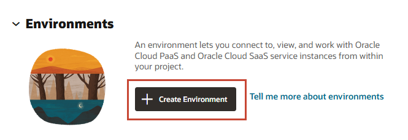
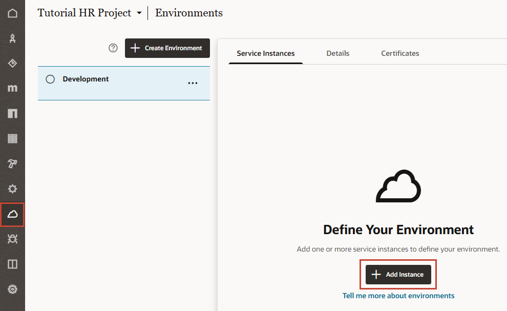
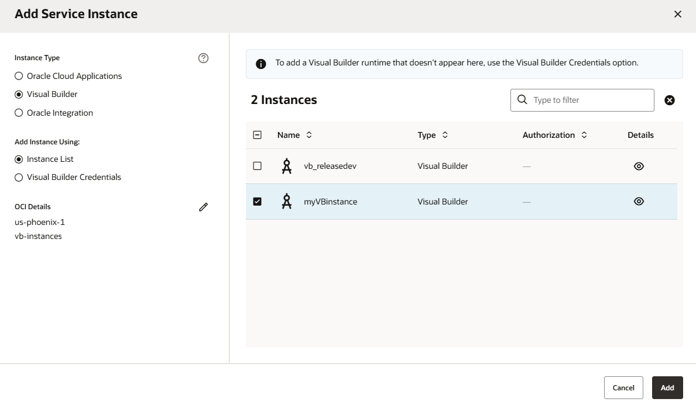
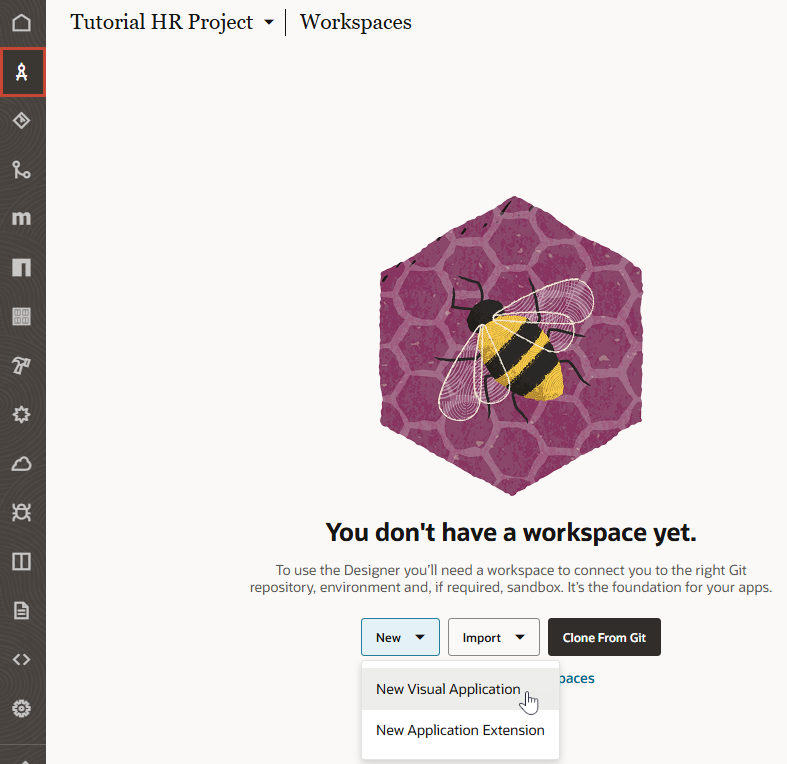
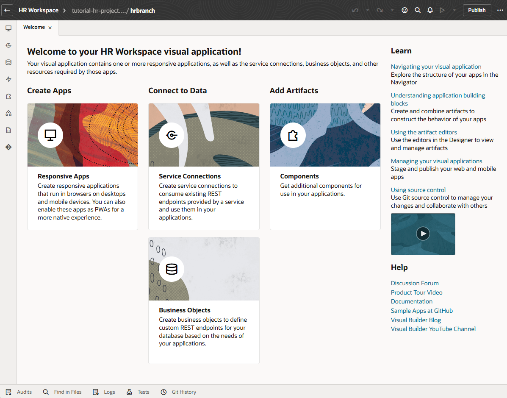

# Create a project for a new visual application

## Introduction

This lab shows you how to create a project for a new visual application—the first step to building a web application in Oracle Visual Builder Studio.

Estimated Time: 10 minutes

### About this Lab

In this workshop, you'll build a simple Human Resources app using a _project_. Every project in VB Studio is devoted to a discrete software effort, and the project you create in this lab is exclusive to the HR app. The project brings together all the tools you need to create your app: a Git repository to store your source code, an environment to deploy your application, a pipeline to provide continuous integration and delivery, an issue tracking system, and more.

As part of your project, you'll also create a _workspace_, a completely private area for you to work on your application. The changes you make in your workspace are stored in a clone of the project's Git repository, and are not visible to others until you share or publish them.

### Objectives

In this lab, you will:

* Create a project for a visual application
* Create an environment with a separate Visual Builder instance
* Create a workspace to work on your visual application

### Prerequisites

This lab assumes you have:

* A Chrome browser
* A VB Studio instance and a separate Visual Builder instance, with your [VB Studio instance authorized to access the Visual Builder instance](?lab=provision#Task3:AuthorizeVBStudiotoaccessVisualBuilder)

## Task 1: Create a project for a visual application

As someone who creates a project, you'll automatically become the project's owner, responsible for project management. For the purposes of this workshop, we'll assume that you're also the developer who will create the HR web application.

1. On VB Studio's Organization page, click **\+ Create** on the **Projects** tab.

    

2. On the Project Details step of the New Project wizard:

    * Enter **Tutorial HR Project** as the **Name**. You may want to add your name to the project name if you're in a large organization.
    * Enter **Tutorial project** as the **Description**.
    * Leave the **Security** settings as **Private** and **Discoverable** (the default).
    * Leave the **Preferred Language** as **English** (the default).

    Click **Next**.

3. On the Project Template step, leave the Project Template selected as **Empty Project**. Click **Next**.

    

4. On the Project Properties step, leave **Wiki Markup** as **Markdown** and click **Next**.

5. On the Project Team Members step, add other members of your team who will work with you on this visual application. As the project owner, you can control what others can do in this project by granting them membership as a Developer Full Access, Developer Limited Access, Contributor, or even as another Project Owner:

    a. In the **Add Members** field, enter the username of a teammate (for example, Clara Coder), then select the user from the results.

    b. Select a membership role for the user. For demo purposes, let's select **Developer Limited Access**, a role that lets Clara access most project components.

    c. Click **Add**.

    An email containing project details will be sent to Clara Coder. To receive email notifications, the teammate's email address must be verified and notifications set properly in Preferences.

6. Click **Finish**.

    Wait for the project to be provisioned. Once provisioning completes, you'll see the Project Home page, which serves as a window to your workspaces, environments, and repositories, as well as a recent activities feed. On the left are a series of tabs showing the available project components.

    

    Try these tips to optimize your work area:
    * To keep the left navigation menu clutter-free, showing only frequently used items, click , select the items you want under User, and click **Save**. This tutorial commonly uses Workspaces, Git, Merge Requests, Builds, and Environments.

    * To hide the labels and increase screen space, click .

    Because we created a project with no preconfigured settings or content, we now need to create what we need: an environment that connects to a Visual Builder instance and a workspace with a Git repository.

## Task 2: Create an environment with a Visual Builder instance

Define an environment that points to your Visual Builder development instance, where your visual application can be deployed from within the project.

1. On the Project Home page, click **+ Create Environment** under Environments.

    

2. Enter **Development** as the **Environment Name**, then optionally, add a description. Click **Create**.

3. On the Environments page, click **+ Add Instance** to add a Visual Builder instance to your **Development** environment.

    

4. Select **Visual Builder** under Instance Type in the Add Service Instance dialog. With Add Instance Using set to **Instance List**, click  next to OCI Details and choose the region and compartment where your Visual Builder is, then select an instance from the list. (If the instance you want does not show, you're likely missing a policy statement for the OCI compartment used by your VB Studio instance and should [add it in](?lab=provision#Task3:AuthorizeVBStudiotoaccessVisualBuilder).) Once you have the instance you want, select it and click **Add**.

    

    **Note:** To add an instance that's doesn't show in the Instance list because it's connected to a different OCI account, select **Visual Builder Credentials** under Add Instance Using, enter the URL to your Visual Builder instance's home page (for example, http://yourserver/ic/builder), the username and password of someone who can access that instance, and click **Add**.

    If you're prompted for authorization enabling OAuth access to your Visual Builder instance (typically because your Visual Builder and VB Studio instances use different identity domains), click **Authorize**, then enter credentials to connect to your Visual Builder instance.

    Wait for the instance's Status to turn green, from 'Unknown' to 'Available'.

5. Click  **Project Home** in the left navigator to see your Development environment now defined.

## Task 3: Create a workspace for a visual application

You now need to create a workspace, a private area for you to work on your visual application. A workspace is typically associated with a Git repository where all your source files are stored.

1. On the Project Home page, click **Go to Workspaces** under Workspaces.

2. On the Workspaces page, click **New**, then select **New Visual Application**.

    

3. In the New Visual Application dialog:

    * Enter **HR Workspace** as the Workspace Name.
    * Leave **Development** (where you previously added a Visual Builder instance) as your Development Environment. If only one environment is available, it is automatically selected for you.
    * Leave **Default VB Application** as the Visual Application Template.
    * Click **Create new repository** under Git Repository, enter **tutorial-hr-project** as the Repository Name and **hrbranch** as the Working Branch Name.

    Click **Create**.

    Once your workspace is created, it opens on the Welcome page in the integrated development environment known as the Designer. The Welcome page is a launching point for creating apps, connecting to data, or adding artifacts. Before we proceed, let's take a tour of the Designer to better understand your workspace.

    

    On the left edge is a vertical toolbar with icons representing Web Applications, Service Connections, Business Objects, and so on. This toolbar is the Navigator, which helps you move between the artifacts in your visual application.

    Now take a look at the header:

    

    * On the left is the name of your current workspace, **HR Workspace**. Next to it is the project's Git repository (**tutorial-hr-project.git**) and the branch currently associated with your workspace (**hrbranch**).

        The **tutorial-hr-project.git** repo stores your visual application's files and is known as your project's _remote_ repository. If you were to look at your Git repo, you'll see it includes the **main** and **hrbranch** branches, created with initial content for your visual application. The **main** branch is the default branch created when a new repo is generated and is the source from which your visual application is built. The **hrbranch** you see in your workspace is a working copy of the remote **hrbranch** and serves as your _local_ repository. It initially has the same set of source files as the remote branch, but will include the changes you make as you develop your visual application.

        Clicking  will take you back to the Project Home page.

    * Elements on the right let you perform various other actions, such as undo changes or search the Git repository for a file. This workshop primarily demonstrates the options to preview your app, share it, and publish changes. If you make a mistake during this workshop, click   to back out of the last step you did, or the arrow next to it to undo more than one step.

    Take note of the footer, which has tools that help you debug and maintain your visual app (we'll briefly look at Audits and Git History in this workshop):

    

    Keep in mind that VB Studio saves your changes automatically as you work. When you begin to make changes, a timestamp at the bottom of the page will show the time  your work was last saved. Note that changes are only saved to your local workspace repo—but more on that later.

    You are now ready to create a web app and may **proceed to the next lab**.

## Acknowledgements

* **Author** - Sheryl Manoharan, VB Studio User Assistance, November 2021
* **Last Updated By/Date** - Sheryl Manoharan, July 2025
