# Access data from an external REST service

## Introduction

This lab shows you how to access data from an external REST service.

Estimated Time:  15 minutes

### About this lab

So far in this workshop, you've created business objects to store your data in an embedded database and accessed that data through REST endpoints that were automatically created for you. But business objects aren't the only option for data access; in fact, you can connect to *any* REST-based data source by creating a *service connection*.

Service connections let you access data objects exposed by Oracle services as well as external services. If you want to connect to REST APIs exposed by Oracle Cloud Applications or Oracle Integration, you have access to an integrated service catalog. If you want to call an external REST service, you can do that too with just a few clicks. In this lab, we'll create a service connection to a publicly available REST service and wire our pages to get information about the country that an employee works from.

Remember that no matter what form your data takes (business objects or service connections), the basic principles of creating an application are the same. The key difference between the two data sources: business objects store data as part of the app itself, service connections receive data from REST APIs.

### Objectives

In this lab, you will:

* Create a connection to an external REST service
* Add UI components on a page to display data from the REST endpoint
* Create a type and variable to store data from the REST endpoint
* Assign data to the variable
* Test data received from the REST endpoint

### Prerequisites

This lab assumes you have:

* A Chrome browser
* All previous labs successfully completed

## Task 1: Create a connection to an external REST endpoint

In this step, we'll connect the HR application to an external REST endpoint that provides information about a country.

1. Click **Services**  in the Navigator.
2. Click **+ Service Connection** to open the Service Connection wizard.

    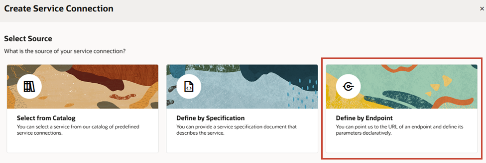

    This wizard presents various options to connect to REST endpoints:
    * When you have access to an Oracle Cloud Applications or Oracle Integration instance, you use the **Select from Catalog** option to access endpoints exposed by these Oracle services.
    * When you have access to a Swagger or Oracle ADF file that describes a service, you use the **Define by Specification** option.
    * When you know the URL of an external REST endpoint, you use the **Define by Endpoint** option—which is what we'll do here.

    Click **Define by Endpoint**.

3. With the **Method** field set to **GET**, enter `https://restcountries.com/v2/alpha/{code}` in the **URL** field and select **Get One** in the **Action Hint** list. Click **Next**.

    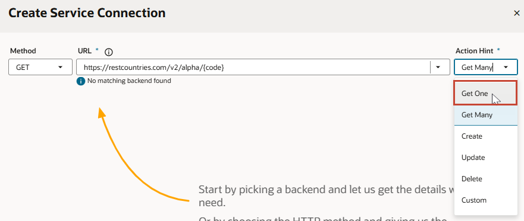

4. Here you'll see several tabs where you can provide additional details for the service connection. In the Overview tab, change the **Service Name** to `Countries` and the **Title** to `Country`.

    

    > **Tip:** Step through the different tabs to see what options you can specify. For example, if your service required a user name and password, you have authentication options on the Server tab that allow your users to access the service securely.

5. When you're ready, test the service connection. Click the **Test** tab, enter `CN` (for China) as the value of the `code` parameter under Path Parameters. Essentially, you're entering a country code as a path parameter to get information about that country. Click **Send Request**.

    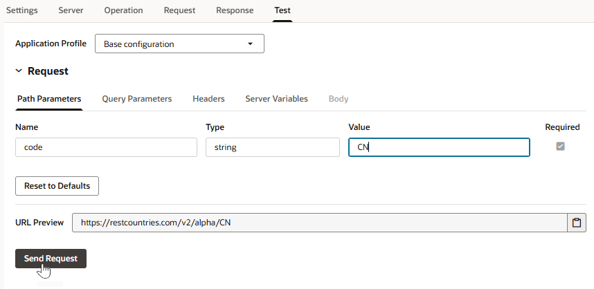

    When the request is successful, click **Save as Example Response** to save the response and create a schema. This way, you tell VB Studio that this response is the typical structure of data received from this service.

    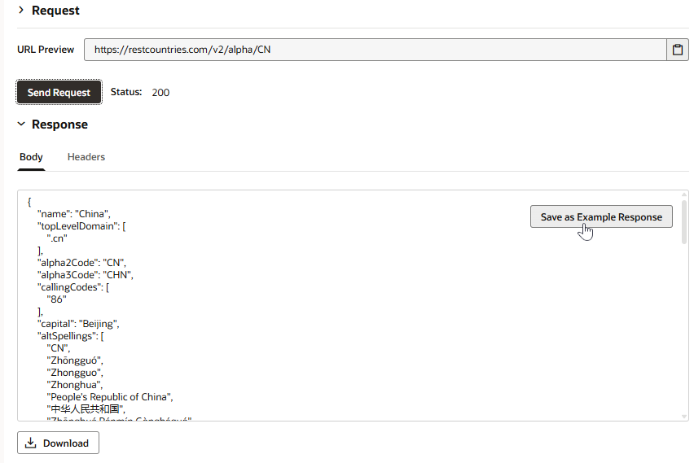

    Click **Create**. A **Countries** service connection shows up in the Services pane.

    If you get an error about CORS not being enabled for the server, switch to the **Server** tab and under **Connection Type**, select **Dynamic, the service does not support CORS**, then try to create the service connection again.

## Task 2: Add fields to the employee's edit page to display country data

Now that we have our service connection, let's change the Edit Employee page to show information about an employee's country. This time, instead of using Quick Starts, we'll manually add fields to the page.

1. Click the **Web Applications**  tab, then select the **main-edit-employee** page.

2. In the Components palette, locate the **Heading** component and drag and drop it onto the canvas, just above the Toolbar component with the Cancel and Save buttons.

3. In the Heading's properties, change the **Text** field's value to `Country Info` and move the **Level** slider to H6.

4. In the Components palette, locate the **Form Layout** component under **Layout** and drag and drop it onto the page under Heading.

5. Let's now add a bunch of other components to this form layout to display country information:

    * Drag and drag an **Avatar** component into the empty form Layout. Change the avatar's **Size** to **Large** in the Properties pane.
    * Drag an **Input Text** component and drop it onto the page under Avatar, then change its **Label Hint** in the Properties pane to `Time Zone`.
    * Drag another **Input Text** onto the page and change its **Label Hint** to `Region`.

    When you're done, your form layout may look something like this:
    

## Task 3: Create a type and variable from the REST endpoint

To pass values to the fields under Country Info in the main-edit-employee page, you'll need to create variables. Variables, when bound to components, store data values retrieved from a REST endpoint and display them to your users. A quick way to do this is by creating a *type* based off the endpoint, so all variables assigned this type have the same data structure.

1. Switch to the **Types** tab, then click **+ Type** and select **From Endpoint**.

    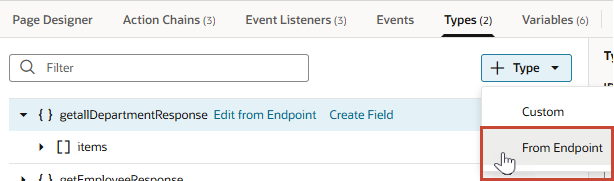

2. In the Create Type From Endpoint wizard, expand **Services** and **Countries**, then select the **GET /alpha/{code}** endpoint.

    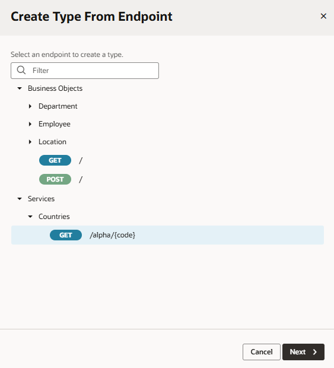

    Click **Next**.

3. On the Define Type step, select the fields you want to display from the response: **flag**, **region**, and **timezones**. For easier identification, change the type name from **getAlphaCode** to **countryType**.

    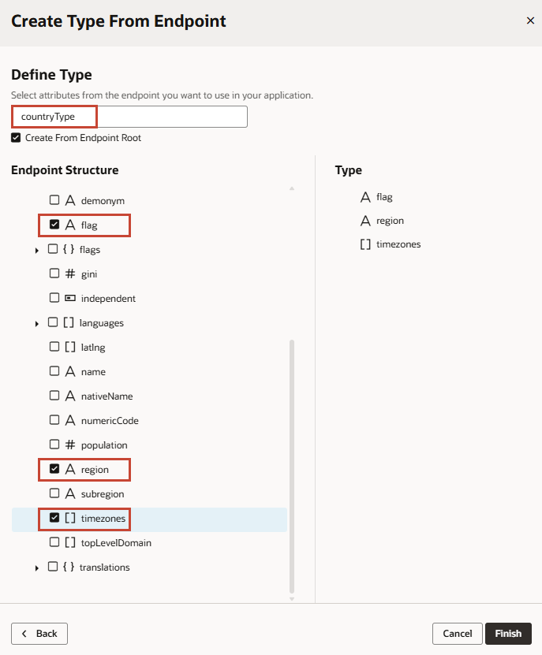

    Click **Finish**. A new **countryType** is created on the Types page.

4. Right-click the newly created countryType type and select **Create Variable**. A new countryTypeVar is created for you. If you look at the variable's properties, you'll see that it is based on the custom type structure we defined.

    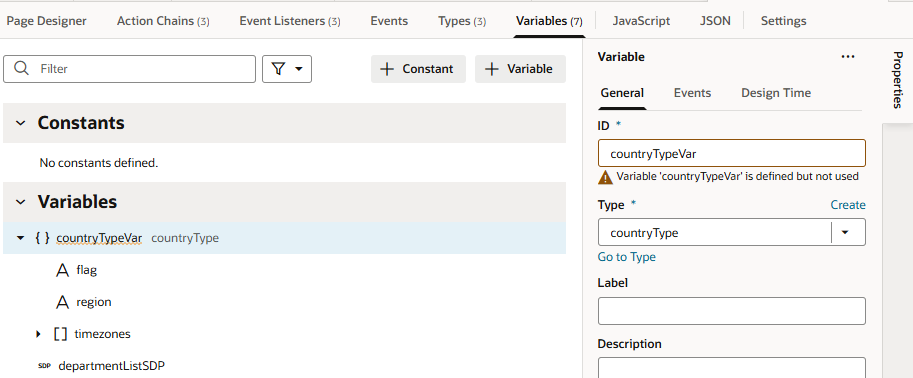

5. Now return to the Page Designer tab for the main-edit-employee page and bind each country field to its corresponding variable. To do this:

    * Select the Avatar component and click its Data tab in the Properties pane. Hover over the **Src** field, click  to open the Variable picker. Expand the **countryTypeVar** object and select **flag**.
    * Select the Time Zone Input Text component, then in its Data tab, click  next to Value. Under **countryTypeVar**, expand **timezones** and select **item[0]**.
    * Select the Region Input Number component, then in its Data tab, click  next to Value and select **region** under **countryTypeVar**.

    Each of the components are now bound to the corresponding variable, but no values show because the variables don't have any data yet.

## Task 4: Assign data to variables

In this step, we'll assign data to the variables by adding a "value" event that triggers an action chain, a sequence that first calls the Country endpoint to fetch data, then populates the variables with the returned data. The event is triggered whenever the main-edit-employee page is loaded.

1. Select the **Country** field's Input Text component in the employee form on the main-edit-employee page.

    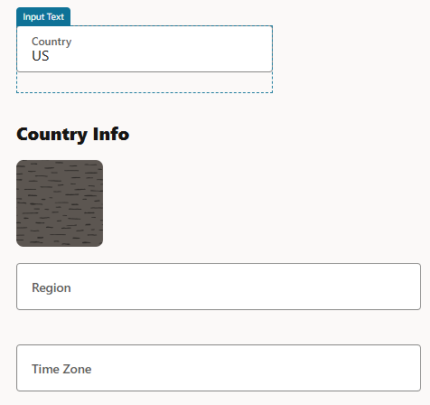

2. Click the component's **Events** tab in the Properties pane, then select **+ New Event** and **On 'value'**.

3. When the InputTextValueChangeChain opens in the Action Chain editor, double-click the **Call REST** action in the Actions palette to add it to the canvas.

4. In the action's Properties pane, click **Select** next to Endpoint to open the Select Endpoint wizard.

5. Expand **Services** and **Countries**, then select **GET /alpha/{code}**. Click **Select**.

6. Because the endpoint requires a country code as a parameter, click **Assign** next to Input Parameters.

    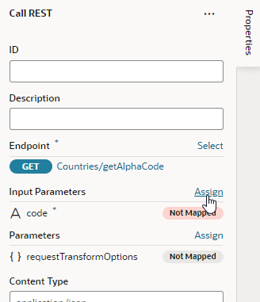

7. On the Sources side, expand **employee** under **Page** and **Variables**, then drag **country** to **code** under **Parameters** on the Target side. This mapping tells VB Studio to use the value of the Country field as the input for the code parameter.

    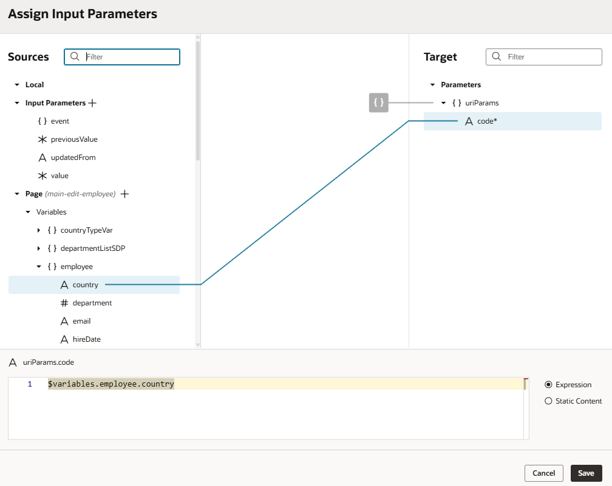

    Click **Save**.

8. Drag and drop an **Assign Variables** action on the canvas to follow the Call REST action. In the Assign Variable action's Properties pane, hover over the **Variable** property, click  to open the Variable picker, and select **countryTypeVar** under **Page**. Hover over the **Value** property, open the Variable picker, expand **callRestCountriesGetAlphaCodeResult** under **Action Chain**, and select **body**.

    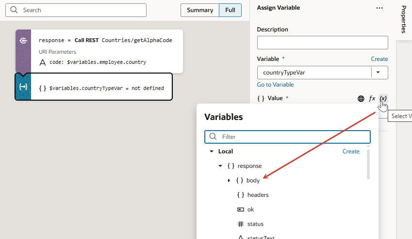

    What we're doing is mapping the data returned by the getAlphaCode REST call to the variables that populate components on the page. Because the field names are identical to the REST response, VB Studio automatically knows how to map each field to its data source.

## Task 5: Test the employee's country details

1. Click **Preview**  to run your application.

2. Select a row, then click **Edit Employee**.

    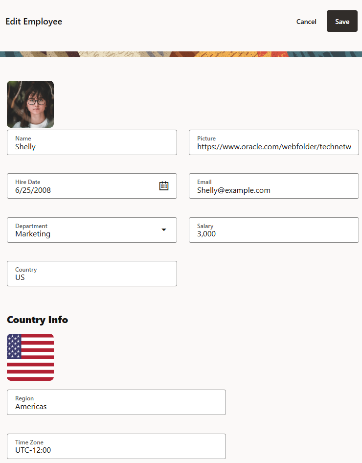

3. Change the employee's Country field to `IE` (for Ireland).

   The employee's information reflects the update in the Country Info section.  Click **Save**, then close the browser tab.

   You may **proceed to the next lab**.

## Acknowledgements

* **Author** - Sheryl Manoharan, VB Studio User Assistance, July 2022
* **Last Updated By/Date** - Sheryl Manoharan, May 2023
