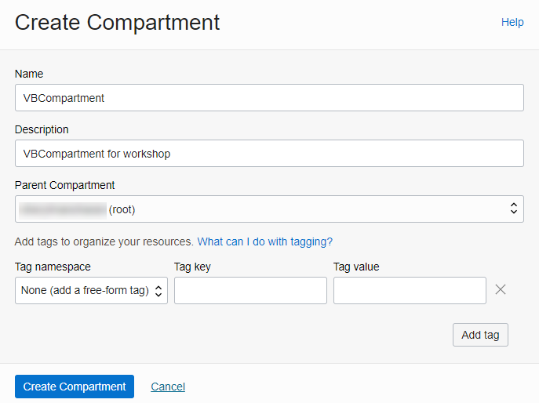
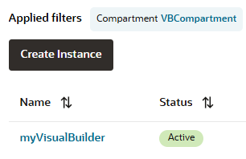
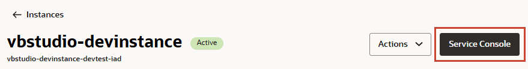
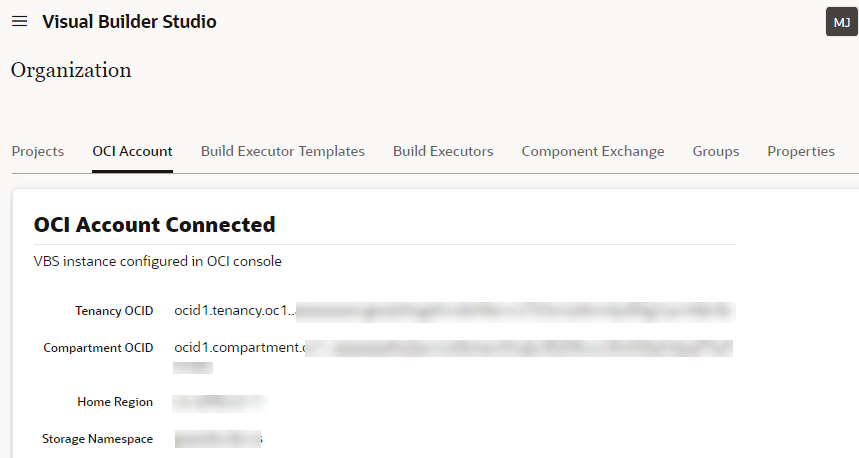

# Provision your instances

## Introduction

This lab walks you through the process of provisioning an Oracle Visual Builder Studio instance and a separate Oracle Visual Builder instance, assuming you don't already have both available to you. If you do, you can skip this lab—but make sure your VB Studio instance is authorized to access your Visual Builder instance before you move on to the next lab.

Estimated Time: 20 minutes

### About this Lab

If you just created a Cloud Account using the instructions in the previous lab, you might want to wait before you attempt to create Visual Builder and VB Studio instances. It could take anywhere between 10 and 30 minutes for a new user account to be fully provisioned (you'll get a email when provisioning is complete). If you already have a Cloud Account, you don't need to wait. Either way, make sure you've signed in to Oracle Cloud as an OracleIdentityCloudService user. *Note: If you log in using an Oracle Cloud Infrastructure (OCI) account, the navigation menu to Visual Builder won't show.*

### Objectives

In this lab, you will:

* Create an instance of Visual Builder
* Create an instance of VB Studio
* Authorize the VB Studio instance to access the Visual Builder instance

### Prerequisites

This lab assumes you have:

* An Oracle Cloud Account
* A Chrome browser

## Task 1: Create a Visual Builder instance

Before you provision a VB Studio instance, create a Visual Builder instance to host the web app you'll create in VB Studio. Visual Builder is a managed service that provides everything your apps need to run successfully, including a web server and a built-in database.

1. Create a compartment to host OCI resources for your Visual Builder instance. You can use the root compartment and the tenancy user that was created when the OCI account was created, but a dedicated compartment is the recommended approach.

   a. On the Oracle Cloud console, click the navigation menu  in the upper left corner, select **Identity & Security**, then **Compartments** under Identity.

   

   b. Click **Create Compartment**.

   

   c. Enter a name for the compartment (for example, `VBCompartment`), add a description (for example, `VBCompartment for workshop`), and leave the Parent Compartment set to the default root compartment. Click **Create Compartment**.

   

2. From the navigation menu, select **Developer Services**, then **Visual Builder**.

    

3. In the **Compartment** field on the Visual Builder instances page, select the `VBCompartment` you created to host the Visual Builder instance, then click **Create Instance**.

   

4. On the Create Instance screen, give your instance a unique name, one that is unlikely to be chosen by another user.  Click **Create Visual Builder Instance**.

    

   When instance creation completes successfully, the instance shows as **Active** in the **Status** column. If you don't see the status change, try refreshing your browser.

    

## Task 2: Create a VB Studio instance

Provision a VB Studio instance to develop and deploy a web app. You can create only one VB Studio instance for an Oracle Cloud account, and it must be created in the `root` compartment. Before you attempt to create an instance, make sure your account has no other VB Studio instance provisioned.

1. Your VB Studio instance requires OCI resources such as VMs for CI/CD builds and storage buckets for project data. It's recommended that you create a dedicated compartment to host these resources, so they aren't mixed with your other resources. To create a dedicated compartment for VB Studio resources:

   a. From the navigation menu, select **Identity & Security**, then **Compartments** under Identity.

     

   b. Click **Create Compartment**.

      

   c. Enter a name for the compartment (for example, `VBStudioCompartment`), add a description (for example, `VBStudioCompartment for workshop`), and leave the Parent Compartment set to the default root compartment. Click **Create Compartment**.

      

2. From the navigation menu, select **Developer Services**, then **Visual Builder Studio**.

   

3. On the Visual Builder Studio instances page, make sure you're in the default root compartment. If required, click the **Compartment** filter next to Applied filters, select `tenancyName` **(root)**, and click **Apply filter** to switch to the root compartment. Click **Create Visual Builder Studio**.

    

4. On the Instance name step of the Create Visual Builder Studio instance wizard, give your instance (to be created in the root compartment) a unique name. Click **Next**.

   

5. On the CI/CD Setup step, select **Yes, I authorize this** to allow Oracle to create compute instances and storage buckets on your behalf and select the `VBStudioCompartment` you created previously.

   

   *Note: If you don't provide authorization, your instance is provisioned with a minimal set of resources (one built-in free VM with fixed software in the default build executor template). You'll also need to manually authorize this VB Studio instance to access your Visual Builder instance.*

   Click **Create Visual Builder Studio**.

   After the instance is created, its Status shows as **Active** on the Visual Builder Studio instances page. Click the instance's name to view its details, including its unique Oracle Cloud Identifier (OCID), on the Instance Info tab.

## Task 3: Authorize VB Studio to access Visual Builder

Your VB Studio instance must be authorized to access Visual Builder instances connected to your OCI account. This step is required if your VB Studio instance was provisioned with the built-in free VM, in which case you must create a new policy as described here. If a policy already exists for your VB Studio instance, see [Updating a Policy's Statements](https://docs.oracle.com/en-us/iaas/Content/Identity/policymgmt/managingpolicies_topic-To_update_the_statements_in_an_existing_policy.htm) to check the policy and add any missing statements. In either case, make sure the policy statement that enables this access is correctly defined.

1. From the navigation menu, select **Identity & Security**, then **Policies** under Identity.

   

2. On the Policies page, make sure the root compartment is selected, and click **Create Policy**.

3. On the Create Policy page, enter a unique policy name (for example, `VBStudio-Policy-<instanceName>-<compartmentName>`) and enter a description (for example, `Manually created policy for CI/CD authorization in VB Studio`).

4. Under Policy Builder, click **Show manual editor** and paste *all* of these statements in the text box:

    ```text
    <copy>
    Allow any-user to inspect all-resources in tenancy where request.principal.id in ('<VBS_instance_OCID>')
    Allow any-user to read visualbuilder-instance in tenancy where request.principal.id in ('<VBS_instance_OCID>')
    Allow any-user to read integration-instance in tenancy where request.principal.id in ('<VBS_instance_OCID>')
    </copy>
    ```

   `<VBS_instance_OCID>` is the OCID of the VB Studio instance, which you can copy from the instance's Instance Info tab.

   Click **Create**.

## Task 4: Access VB Studio

Access the VB Studio console to get started with creating your web application. When you first access VB Studio, you'll receive an email with the subject **Verify your Oracle Visual Builder Studio email**. Make sure you click the URL link in the email body to verify your email. This is required to receive email notifications from VB Studio.

1. From the navigation menu, select **Developer Services** and **Visual Builder Studio**.

2. Click your VB Studio instance's name on the Visual Builder Studio Instances page, then click **Service console**.

   

   The VB Studio console opens in a new browser tab, on the Organization page in the Projects tab.
   

   When you first log in, you see the Welcome page with a link to an introductory video, along with a news feed of additional screens. Close **X** to dismiss the news feed and expand your work area. Close the news banner prompt.

   Now is a good time to set your preferences. To do this, click the user initials in the upper right corner, and select **Preferences**. Use this page to change your display name, set an avatar, change the email address, or set email notification preferences. The email address (yours as well as that of any teammates you add to the project) must be verified and notifications set properly to be able to receive email.

   

   You are now ready to create a project, but before you do that, check if your instance is connected to the built-in free account. Click the **OCI Account** tab. 

      * If you see your OCI account connected (as shown here), you can [jump to the next lab](#next) and get started with creating a project:

        

      * If you see something similar to this image, it means your instance is connected to the built-in free account. This is likely if you did *not* authorize Oracle to create instances to run builds:

        

        In this case, you will need to create your VM build executor as described in the next task before you proceed with the rest of the workshop.

## Task 3: Create the Free VM Build Executor

If you did *not* authorize Oracle to create instances on your behalf when provisioning your VB Studio instance, create your free VM build executor.

1. Click the **Build Executors** tab, then click **Create Free VM Build Executor**.

   

   A new VM build executor is created. If the status of the compute VM corresponding to the executor is Available, Pending, or Stopped, you can go ahead and start your job, but be aware that:
      * Pending: The VM isn't available, so your job may take up to 10 minutes longer while the VM is created.
      * Stopped: Your job will take just a few moments longer while the VM is started.
      * Available: Your job should process immediately.

   You may **proceed to the next lab**.

## Acknowledgements

* **Author** - Sheryl Manoharan, VB Studio User Assistance, November 2021
* **Last Updated By/Date** - Sheryl Manoharan, May 2025
