# Provision Your Instances

## Introduction

This lab walks you through the process of provisioning an Oracle Visual Builder Studio instance and a separate Oracle Visual Builder instance, assuming you don't already have both available to you. If you do, you can skip this lab and move on to the next one.

Estimated Time: 20 minutes

### About this Lab
If you just created a new Cloud account following the instructions in Getting Started, you might want to wait before you attempt to create Visual Builder and VB Studio instances. It could take anywhere between 10 and 30 minutes for a new user account to be fully provisioned and for the navigation menu to show. If you already have a Cloud account, you don't need to wait. Either way, make sure you've signed in to the Oracle Cloud as an Oracle Identity Cloud Service user before proceeding. *Note: If you log in using an Oracle Cloud Infrastructure account, the navigation menu to Visual Builder won't show.*

### Objectives
In this lab, you will:
* Create an instance of Visual Builder
* Create an instance of VB Studio
* Connect your OCI account to your VB Studio instance (optional)

### Prerequisites
This lab assumes you have:
* An Oracle Cloud Account
* A Chrome browser

## Task 1: Create an instance of Visual Builder
Provision a service instance of Visual Builder to host apps created in VB Studio. The Visual Builder instance provides the runtime environment for the web app you'll create in VB Studio. You must provision the Visual Builder instance first, so you have it available for selection as a deployment target when you create a project in VB Studio.

1.  On the Oracle Cloud Get Started page, click the menu in the upper left corner to display the services you can provision:

    

2.  Click **OCI Classic Services**, then select **Visual Builder**:

    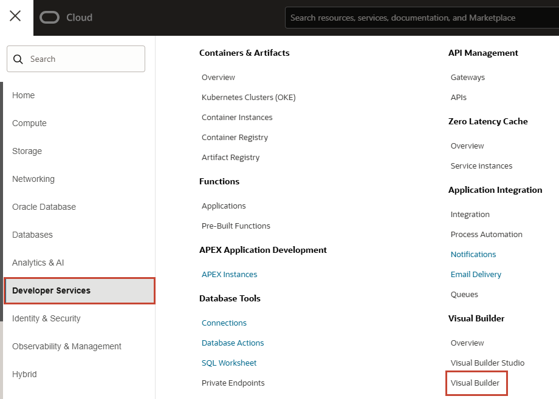

3.  On the Instances tab, click **Create Instance**:

    


4.  On the Create Instance page, fill in the information required. Give your instance a unique name, one that is unlikely to be chosen by another user.  Be sure to select the Region nearest to your location.  Click **Next**.

    

    When the instance has finished provisioning, you'll receive an email.  

5. From the Action menu on the Instances page, click **Open Visual Builder Home Page**.

   

## Task 2: Create an instance of VB Studio
Provision a service instance of VB Studio to develop and deploy your web app. You can create only one VB Studio instance in an Oracle Cloud account. Before you attempt to create an instance, make sure there's no existing VB Studio instance in your account.

1. Navigate back to your Cloud Console and click the menu in the upper left corner, click **OCI Classic Services**, then select **Developer**.

   

2. On the Instances tab, click **Create Instance**:

    

3. On the Create Instance page, fill in the required information. Give your instance a unique name, then select the Region nearest to your location. Click **Next**.

   

3. Review your information and click **Create**.

   

4. Once your service instance is created (you'll receive email that your instance is available), click the Action menu icon on the Instances page and select **Access Service Instance**.

   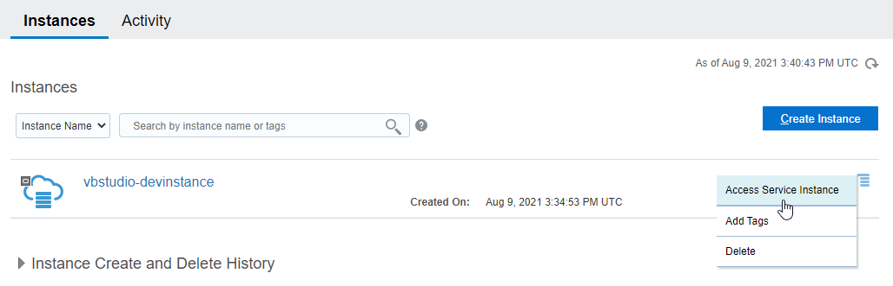

   The VB Studio console opens in a new browser tab, on the Organization page in the Projects tab.
   

   When you first log in, you see the Welcome page with a link to an introductory video, along with a news feed of additional screens. Close **X** to dismiss the news feed and expand your work area.

   It's also a good idea to set your preferences. To do this, click the user initials in the upper right corner, and select **Preferences**. Use this page to change your display name, set an avatar, change the email address, or set email notification preferences. The email address (yours as well as that of any teammates you add to the project) must be verified and notifications set properly to be able to receive email.

   

   You are now ready to create a project but before you do that, you might want to check if your instance is preconfigured with a built-in Oracle Cloud Infrastructure (OCI) account, which lets you access resources to run builds in VB Studio. This free account isn't available in all OCI regions and data centers, so click the **OCI Account** tab to check if your instance includes it. If you see something similar to this image, it means your instance is connected to the built-in free account:

  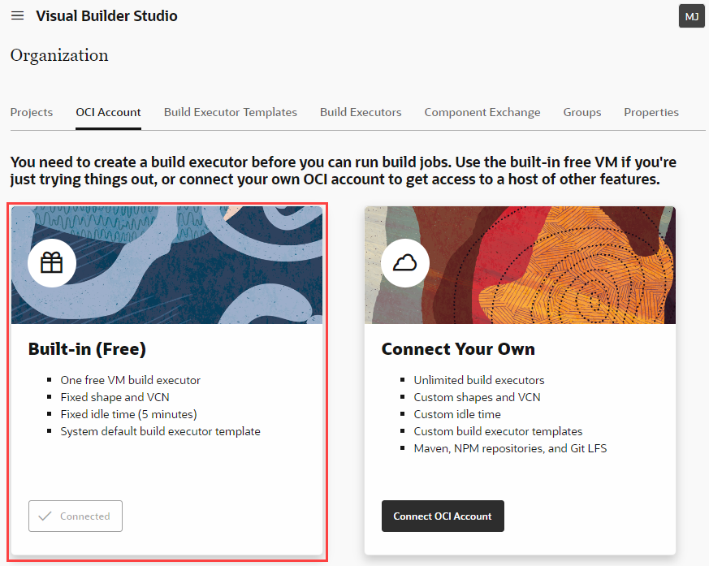

  The free account provides a minimal set of resources (detailed [here](https://docs.oracle.com/en/cloud/paas/visual-builder/visualbuilder-administration/set-oracle-visual-builder-studio.html#GUID-759853ED-5561-4031-AC01-773D58992CA3)), sufficient to try out VB Studio. If this is enough for your needs, you can [jump to the next lab](#next) and get started with creating a project. If your data center does not include this free account or you want to explore more of VB Studio, continue with the following tasks to connect your own OCI account.

## Task 3: Set up the OCI account

To connect your VB Studio instance to OCI resources such as VMs for builds and storage buckets for project data, you need to set up your OCI account with a dedicated compartment and a separate Identity and Access Management (IAM) user. This allows you to organize VB Studio resources better because they aren't mixed with your other resources.

1. Create a separate compartment to host VB Studio resources:

       a. Return to your Oracle Cloud console, then click the menu in the upper left corner, select **Identity & Security**, then **Compartments** under **Identity**.
       

       b. Click **Create Compartment**.
       

       c. Enter `VBStudioCompartment` as the Name, add a description (for example, `VBStudioCompartment for workshop`), and leave the Parent Compartment set to the default root compartment. Click **Create Compartment**.
       

2. Create a local user to access the compartment you've created:

      a. In the navigation menu, select **Identity & Security**, then under **Identity**, select **Users**.
      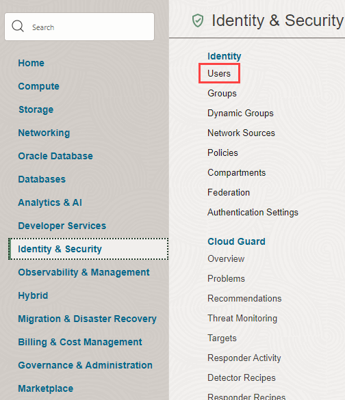

      b. Click **Create User**.
      

      c. Select the IAM user type, then enter `vbstudiouser` as the Name, add a description (for example, `User to access VBStudioCompartment`), and optionally, an email. Click **Create**.
      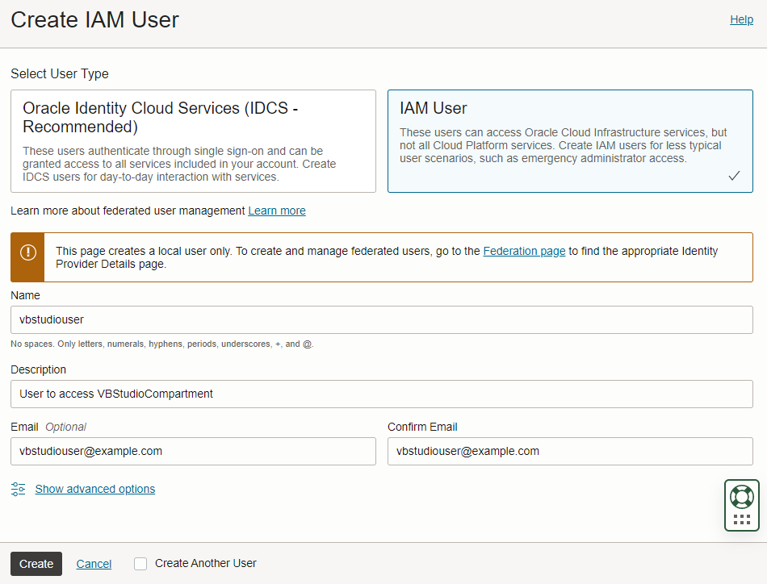

3. On your computer, generate a private-public key pair in the PEM format:

    a. In the Console header, click the Cloud Shell icon. Note that the OCI CLI running in the Cloud Shell will execute commands against the region selected in the Console's Region selection menu when the Cloud Shell was started.
    

    b. Run the following commands in the cloudshell to generate a public and private key pair.

    ```
    <copy>
    mkdir ~/.oci
    openssl genrsa -out ~/.oci/oci.api.key.pem 2048
    chmod go-rwx ~/.oci/oci.api.key.pem
    openssl rsa -pubout -in ~/.oci/oci.api.key.pem -out ~/.oci/oci.api.key.public.pem
    </copy>
    ```
    Here are the steps for reference:
    

    c. Run the following command to **copy the generated _public_ key** and paste it in a text editor like notepad, we will need it for the next step.
    ```
    <copy>
    cat ~/.oci/oci.api.key.public.pem
    </copy>
    ```
    d. Make sure to include ----BEGIN PUBLIC KEY---- and ----END PUBLIC KEY----

    

    e. Run the following command to **copy the generated _private_ key** and paste it in a notepad, we will need it later on.
    ```
    <copy>
    cat ~/.oci/oci.api.key.pem
    </copy>
    ```
    f. Make sure to include ----BEGIN RSA PRIVATE KEY---- and ----END RSA PRIVATE KEY----

    

    g. Click **X** to exit the cloudshell.

4. Upload the public key to the user's details page:

    a. On the Users page, click **vbstudiouser**.
       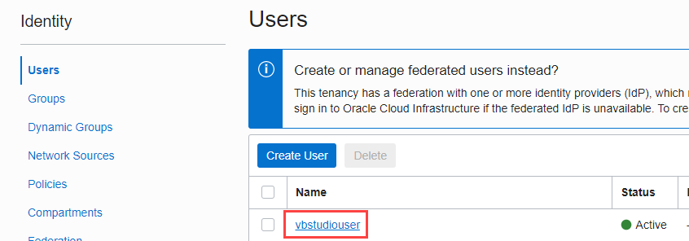

    b. Scroll down and click **API Keys**, then click **Add Public Key**.
       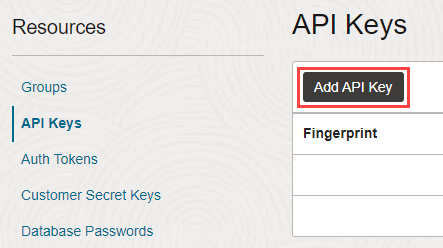

    c. Click **Paste Public Key** and paste the contents of the public key that you copied. Click **Add**, then **Close**.
       

5. Create a group for the user who can access the VB Studio compartment and add the user to the group:

    a. In the navigation menu, select **Identity & Security**, then select **Groups** under **Identity**.
       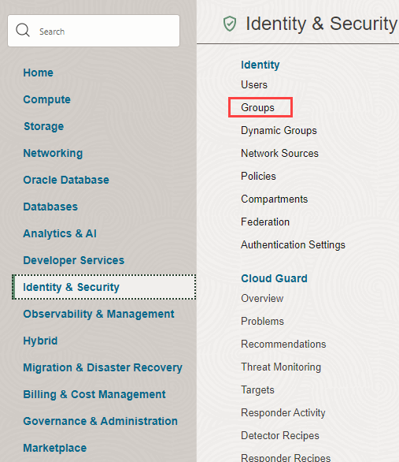

    b. Click **Create Group**.
       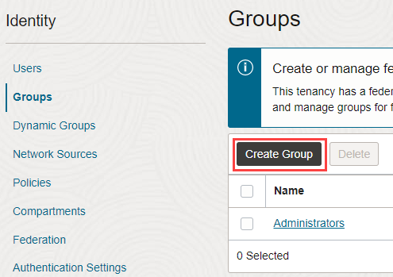

    c. Enter `VBStudioGroup` as the Name, add a description (for example, `Group for VB Studio users`), and click **Create**.
       

    d. On the Group Details page, click **Add User to Group**.
       

    e. Select the **vbstudiouser** and click **Add**.
       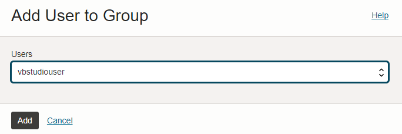

6. In the **root** compartment, create a policy to allow the group you created access to the VB Studio compartment:

    a. In the navigation menu, select **Identity & Security**, then select **Policies** under **Identity**.
       

    b. Make sure the root compartment is selected in the Compartment list.
       

    c. Click **Create Policy**.
       

    d. Enter `VBStudioPolicy` as the Name and add a description (for example, `Policy for VB Studio`). Make sure the root compartment is selected as the Compartment.

    e. Under Policy Builder, click **Show manual editor** and enter these statements:
       ```
       <copy>
       Allow group VBStudioGroup to manage all-resources in compartment VBStudioCompartment
       Allow group VBStudioGroup to read all-resources in tenancy
       </copy>
       ```
    f. Click **Create**.
       

## Task 4: Get OCI credentials

You now need the unique Oracle Cloud Identifiers (OCIDs) of the VB Studio compartment and user, as well as other details of your environment to help you connect VB Studio to OCI. You can get all this information from the Oracle Cloud console.

1. First, let's retrieve the Tenancy OCID, Home Region, and Storage Namespace. In the navigation menu, select **Governance & Administration**, then under **Account Management**, select **Tenancy Details**.

   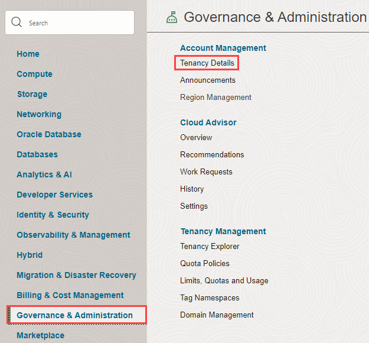

2. In a notepad, copy and paste the Tenancy OCID from the **OCID**, Home Region from the **Home Region**, and the Storage Namespace from the **Object Storage Namespace**.

   

   Now, let's retrieve the User OCID and Fingerprint.

3. Click the navigation menu again and select **Identity & Security**. Under **Identity**, select **Users**.

   

4. On the Users page, click the **vbstudiouser** you created.

   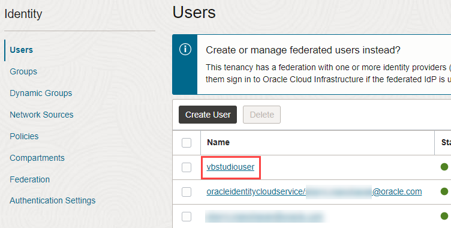

5. On the User Details page, copy the User OCID from **OCID** and paste it in notepad.

   

6. To retrieve the fingerprint of the private-public key pair associated with the `vbstudiouser` account, scroll down to the Resources section, select API Keys, and copy the fingerprint value.

   

7. Now let's get the Compartment OCID. In the navigation menu, select **Identity & Security**, then **Compartments** under **Identity**.
   

8. On the Compartments page, click **VBStudioCompartment**.
   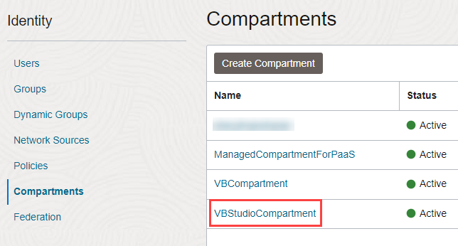

8. Copy and paste the compartment's OCID to your notepad.
   

9. Finally, check for the private key. The private key file was generated and saved on your computer when you created the private-public key pair in the PEM format. As you recall, we copied the private key at the beginning of this lab and pasted it into a notepad. You'll now need this for the next task.

## Task 5: Connect the OCI account
With all the necessary information copied, connect your VB Studio instance to the OCI account.

1. Return to the VB Studio console, then on the Organization page, select **OCI Account** and click **Connect** (or **Connect OCI Account**).

   

2. Use the information you've copied to fill out the Configure OCI Account page.

    - You can leave the Passphrase field empty because we generated the private-public key without a passphrase.
    - When you enter a private key, the Fingerprint field is automatically populated. Check whether this value matches the fingerprint value that you previously copied. If it doesn't, update it to enter the correct value.

3. Select the requirements check box, click **Validate**, then **Save**.

   

    You may **proceed to the next lab**.

## Acknowledgements
* **Author** - Sheryl Manoharan, VB Studio User Assistance, November 2021
* **Last Updated By/Date** - Sheryl Manoharan, February 2022
