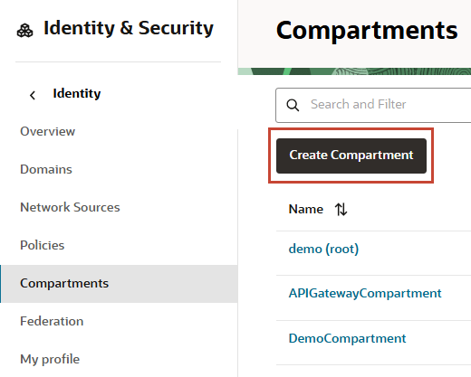
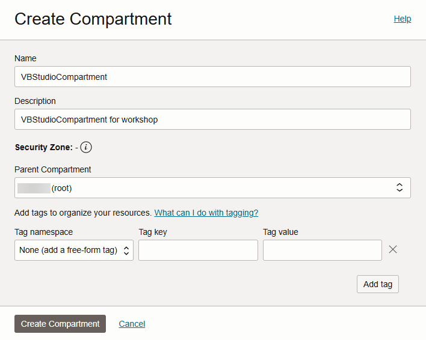
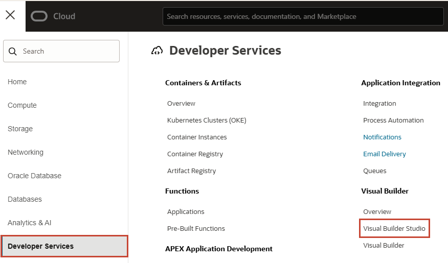
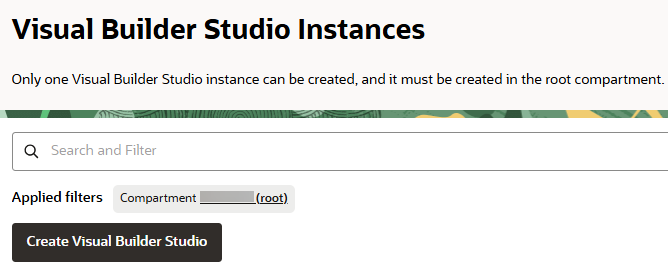
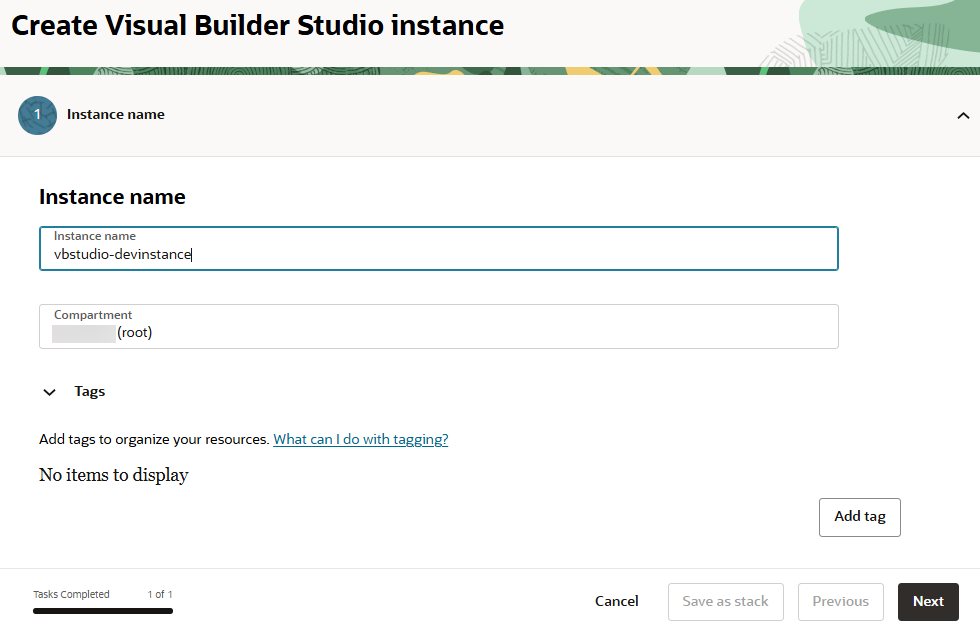
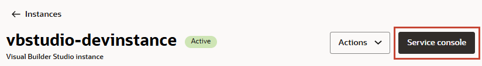
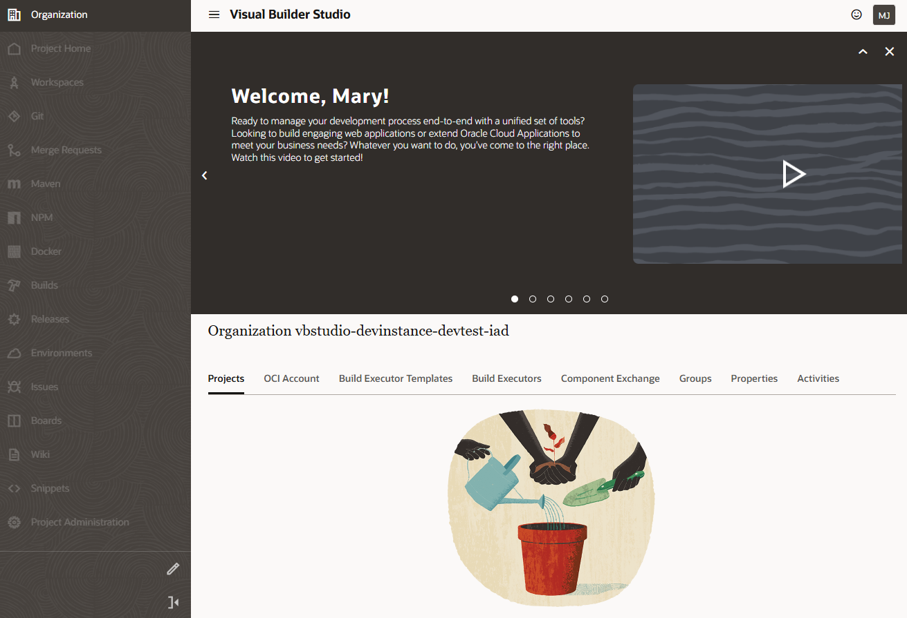
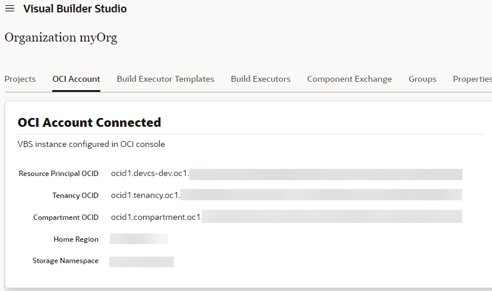

# Provision your instances

## Introduction

This lab walks you through the process of provisioning an Oracle Visual Builder Studio instance and a separate Oracle Visual Builder instance, assuming you don't already have both available to you. If you do, you can skip this lab and move on to the next one.

Estimated Time: 20 minutes

### About this Lab

If you just created a Cloud Account using the instructions in the previous lab, you might want to wait before you attempt to create Visual Builder and VB Studio instances. It could take anywhere between 10 and 30 minutes for a new user account to be fully provisioned (you'll get a email when provisioning is complete). If you already have a Cloud Account, you don't need to wait. Either way, make sure you've signed in to Oracle Cloud as an Oracle Identity Cloud Service user. *Note: If you log in using an Oracle Cloud Infrastructure (OCI) account, the navigation menu to Visual Builder won't show.*

### Objectives

In this lab, you will:

* Create an instance of Visual Builder
* Create an instance of VB Studio

### Prerequisites

This lab assumes you have:

* An Oracle Cloud Account
* A Chrome browser

## Task 1: Create a Visual Builder instance

Before you provision a VB Studio instance, create a Visual Builder instance to host the web app you'll create in VB Studio. Visual Builder is a managed service that provides everything your apps need to run successfully, including a web server and a built-in database. You must provision the Visual Builder instance first, so you have it available for selection as a deployment target when you create a project in VB Studio.

1. Create a compartment to host OCI resources for your Visual Builder instance. You can use the root compartment and the tenancy user that was created when the OCI account was created, but a dedicated compartment is the recommended approach.

   a. On the Oracle Cloud Get Started page, click the menu  in the upper left corner.

   b. Select **Identity & Security**, then **Compartments**.

   

   c. Click **Create Compartment**.

   

   d. Enter `VBCompartment` as the name, add a description (for example, `VBCompartment for workshop`), and leave the Parent Compartment set to the default root compartment. Click **Create Compartment**.

   

2. Return to the Oracle Cloud Get Started page and click the menu in the upper left corner.

   <!--  -->

3. Select **Developer Services**, then **Visual Builder**.

    

4. In the **Compartment** field on the Visual Builder instances page, select the `VBCompartment` you created to host the Visual Builder instance, then click **Create Instance**.

    

5. On the Create Instance screen, give your instance a unique name, one that is unlikely to be chosen by another user. Click **Create Visual Builder Instance**.

    

     When instance creation completes successfully, the instance shows as **Active** in the **Status** column. If you don't see the status change, try refreshing your browser.

    

## Task 2: Create a VB Studio instance

Provision a VB Studio instance to develop and deploy a web app. You can create only one VB Studio instance in an Oracle Cloud account. Before you attempt to create an instance, make sure your account has no other VB Studio instance provisioned.

1. Your VB Studio instance requires OCI resources such as VMs for builds and storage buckets for project data. It's recommended that you create a dedicated compartment to host these resources, so they aren't mixed with your other resources. To create a dedicated compartment for VB Studio resources:

   a. On the Oracle Cloud Get Started page, click the menu  in the upper left corner, and select **Identity & Security**, then **Compartments**..

     

   b. Click **Create Compartment**.

      

   c. Enter `VBStudioCompartment` as the Name, add a description (for example, `VBStudioCompartment for workshop`), and leave the Parent Compartment set to the default root compartment. Click **Create Compartment**.

      

2. Now return to your Oracle Cloud console and click the menu in the upper left corner, select **Developer Services**, then **Visual Builder Studio**.

   

3. On the Visual Builder Studio instances page, click **Create Visual Builder Studio**.

    

4. On the Instance Name screen, give your instance a unique name and make sure your root compartment is selected. Click **Next**.

   

5. On the CI/CD Setup screen, select the `VBStudioCompartment` you created previously and make sure you select **Yes, I authorize this** to allow Oracle to create instances on your behalf.

   

   *Note: If you don't provide authorization, your instance is provisioned with a built-in OCI account that provides access to a minimal set of resources (one free VM build executor with fixed software in the default build executor template).*

   Click **Create Visual Builder Studio**.

   When your instance is created, its details show in the Instance Info tab. You'll also receive an email with the subject **Verify your Oracle Visual Builder Studio email**. Make sure you click the URL link in the email body to verify your email. This is required to receive email notifications from VB Studio.

6. Now click **Service Console** to open Visual Builder Studio.

   

   The VB Studio console opens in a new browser tab, on the Organization page in the Projects tab.
   

   When you first log in, you see the Welcome page with a link to an introductory video, along with a news feed of additional screens. Close **X** to dismiss the news feed and expand your work area. Close the news banner prompt.

   Now is a good time to set your preferences. To do this, click the user initials in the upper right corner, and select **Preferences**. Use this page to change your display name, set an avatar, change the email address, or set email notification preferences. The email address (yours as well as that of any teammates you add to the project) must be verified and notifications set properly to be able to receive email.

   

   You are now ready to create a project, but before you do that, check if your instance is connected to the built-in free account. Click the **OCI Account** tab. If you see your OCI account connected (as shown here), you can [jump to the next lab](#next) and get started with creating a project.

   

   If you see something similar to this image, it means your instance is connected to the built-in free account. This is likely if you did *not* authorize Oracle to create instances to run builds.

   

   In this case, you will need to create your VM build executor as described in the next task before you proceed with the rest of the workshop.

## Task 3: Create the Free VM Build Executor

If you did *not* authorize Oracle to create instances on your behalf when provisioning your VB Studio instance, create your free VM build executor.

1. Click the **Build Executors** tab, then click **Create Free VM Build Executor**.

   

   A new VM build executor is created. If the status of the compute VM corresponding to the executor is Available, Pending, or Stopped, you can go ahead and start your job, but be aware that:
      * Pending: The VM isn't available, so your job may take up to 10 minutes longer while the VM is created.
      * Stopped: Your job will take just a few moments longer while the VM is started.
      * Available: Your job should process immediately.

   You may **proceed to the next lab**.

## Acknowledgements

* **Author** - Sheryl Manoharan, VB Studio User Assistance, November 2021
* **Last Updated By/Date** - Sheryl Manoharan, May 2023
