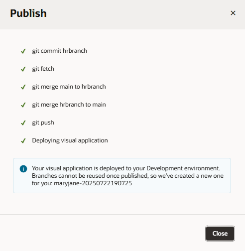
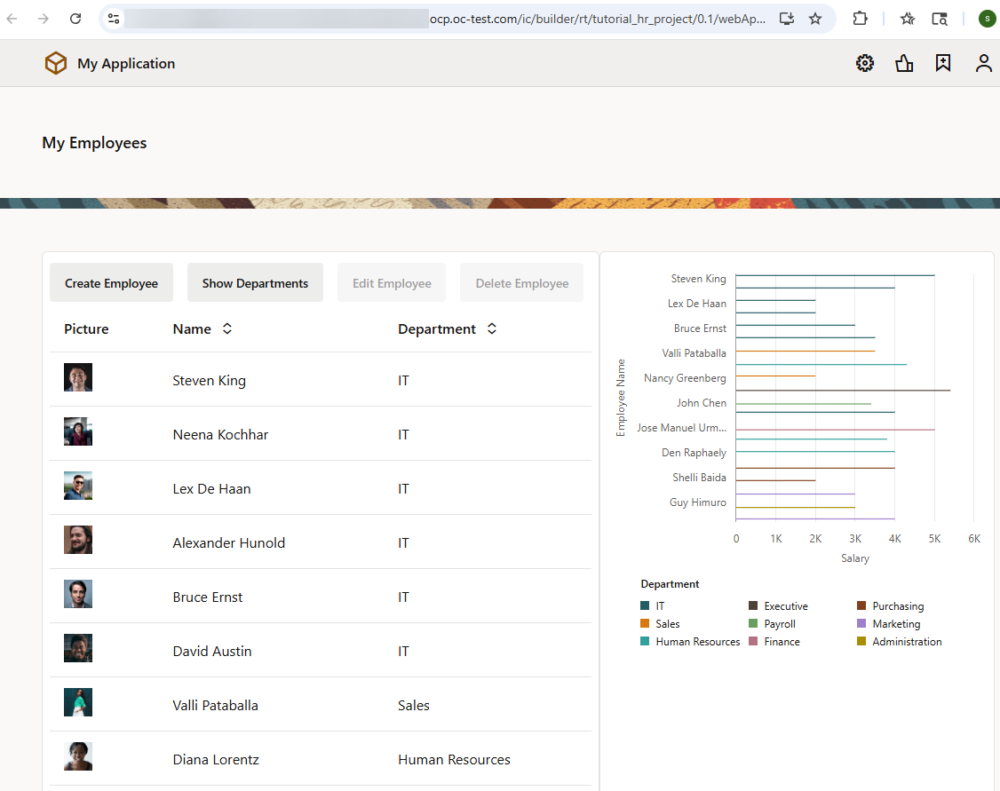
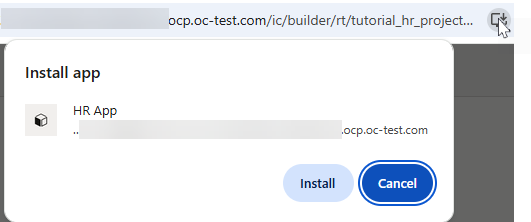

# Publish a web app

## Introduction

This lab shows you how to publish your web app by merging your changes to the project's default branch.

Estimated Time: 15 minutes

### About this Lab

When the process of reviewing your HR web app is done, you are ready to publish the application and make your changes public. Publishing saves your web app's code to a remote branch, then to the project's default branch (`main`). You can use the **Commit** and **Push** Git options in your workspace to save your changes to a remote branch (as we did in a previous lab), then use the **Merge** option to push your changes to `main`. Or, you can do all of this at the click of a single **Publish** button (as we'll do in this lab).

Once your changes are successfully merged, VB Studio automatically deploys the web app to your environment's Visual Builder instance and creates a permanent URL to access the application. Note that the changes are deployed *directly* to your VB instance by default. This is the simplest, most straightforward approach to quickly see your changes. If you want others to review your changes as part of a merge request or you'd like to automate some lifecycle operations, you'll want to use CI/CD pipelines. See [Use CI/CD Pipelines for Deployment](https://docs.oracle.com/en/cloud/paas/visual-builder/visualbuilder-administration/use-ci-cd-pipelines-deployment-vis-apps.html) for details. For simplicity, this workshop only showcases direct deployment.

<!--No matter how you decide to save your changes, it's a good idea to always get your code reviewed and approved before you merge it to the project's **main** branch. Because this code base is meant to be stable, it is usually protected, requiring code to be reviewed through a merge request. If your project was set up to protect the **main** branch, merging your changes will require approval. In this lab, you'll create a merge request to review your changes, but for demonstration purposes, you'll merge the code to the **main** branch without approval.-->

### Objectives

In this lab, you will:

* Publish the HR web app
* View the deployed application
* Import data to the deployed application
* (Optional) Install the application as a PWA

### Prerequisites

This lab assumes you have:

* A Chrome browser
* All previous labs successfully completed

## Task 1: Publish the application

After your web app has been thoroughly tested, you are ready to publish it to your development environment.

1. Click**Workspaces**, then **HR Workspace** in the Workspaces table.
2. When your workspace opens, click **Publish** in the header.
3. In the Publish dialog box, enter a description of your changes in the **Commit Message** field.

    

    Leave the **Target Branch** set to the `main` branch, but take note of the **New Working Branch Name**. Once you publish a branch, you can no longer use it, so VB Studio automatically creates a new working branch and switches your workspace to it for any future changes. It's recommended that you provide a more meaningful name for your new working branch.

    Click **Publish**.

    

    What you're seeing are the Git steps taken to push your changes from the local hrbranch to the remote hrbranch, then to merge them to the project's main branch. Click **Close**.
<!--5. If you're prompted to authorize your environment, click **OK** in the Authorization Required dialog, then click **Authorize** in the Authorize Jobs page. If additionally prompted to set up OAuth, click **Authorize**. You may need to enable popups in your browser.

    Once you've provided authorization, click **Publish** again in your workspace to restart the publishing process. Make sure the dialog still has all the details you added in the previous step.

6. When the request to merge your changes from **hrbranch** to **main** is created, click **Close**. Both your reviewer and you will be notified that a new merge request has been created.

    

7. Return to the project home, then click  **Merge Requests** in the left navigator. You'll see your merge request listed here. For a quick summary of the merge request, click  **Details**.
8. Click **1 Merge Request for branch 'hrbranch'**. All details of the merge request, including its current status and all previous commits, will be shown:

    

    You can't create another merge request from your workspace until your changes are merged, but you can use the **Commit** and **Push** options in the header's Git repository menu to update a merge request that's pending approval.

## Task 2: Merge changes to the default branch

Assuming your merge request has been approved, let's now merge your changes to the project's **main** branch in the remote repository.

1. Click **Merge** on the Merge Requests page.
2. In the Merge dialog, enter a message, select **Delete branch** if you want to delete the branch after the merge, and click **Create a Merge Commit**.

    

    The merge request shows as Merged. If you didn't choose to delete the branch, you can do so now if you want.

    Once your changes are merged, VB Studio automatically kicks off build jobs that package and deploy your visual application to the development environment. These jobs—**tutorial-hr-project-Package** and **tutorial-hr-project-Deploy**—were automatically generated when your workspace was first created. VB Studio also creates a pipeline, which, by default, runs the package job before the deploy job, so the latest application artifacts are packaged for deployment.

    Click  **Builds** to view the progress of your build jobs.

     -->

## Task 2: View the deployed application

Once your web app is successfully deployed to your VB instance, you can view it from your environment's list of deployments.

1. Click  **Go to Project page**.

2. in the left Navigator, click  **Environments**, then **Deployments** for the Development environment.
3. Expand the **tutorial-hr-project** that shows the **Deployed** status, then click **hrwebapp**.

    

    The application opens in a new browser tab, but without any data. While you can use an empty database in your development environment, it helps to have some data—we'll see how you can import data to your app in the next step.

## Task 4: Import data to the deployed application

A deployed application does not automatically include its business object data, so you'll need to manually import data for the application in the development environment. You can import the data you used in your workspace or add entirely different data, as we'll do now.

**Note:** These steps apply only when your environment's Visual Builder instance is in the same identity domain as your VB Studio instance. When it is in a different domain, you won't see deployment actions such as export, import, or undeploy (as shown here). Instead, you must add an **Import Data** step to a build job (either as part of your current deployment job or as a brand new import job) to do this action for you. See [Configure a Build Job to Manage Deployed Visual Apps](https://www.oracle.com/pls/topic/lookup?ctx=en/cloud/paas/visual-builder&id=VBBVA-GUID-B466AE27-9924-4A44-954F-5178213ECF65). Optionally, skip this step and complete the workshop  without importing data to the application.

1. Click [this link](https://c4u04.objectstorage.us-ashburn-1.oci.customer-oci.com/p/EcTjWk2IuZPZeNnD_fYMcgUhdNDIDA6rt9gaFj_WZMiL7VvxPBNMY60837hu5hga/n/c4u04/b/livelabsfiles/o/developer-library/hr-application.zip) and download the `hr-application.zip` file. The zip file contains CSV files of the Location, Department, and Employee business objects with more records and data.
2. In the Deployments tab, click **Actions**  for the deployed tutorial-hr-project and select **Import Data**.

    

3. In the Import Data dialog box, click the upload box, select the `hr-application.zip` file you previously downloaded, and click **Import Data**.

    When the import succeeds, click **Close**.

    

4. Refresh the **hrwebapp** application that you opened previously in a browser tab.

    The application displays the newly imported data.

    

    You can now make a note of this URL to share with public users.

## Task 5: Install your application as a PWA

You're now ready to install the HR app as a PWA.

1. Click the **Install HR App**  icon in the address bar, then **Install** when prompted.

    

    If you access this app on a mobile device, you'll be prompted to add the app to your phone's home screen as well.

2. When the app opens on your device as a standalone app, try it out and test its functionality.

   

    When you are done, click **X** to close the app. You can always click  on your device's home screen or laptop to open the app again. Remember also to close the deployed app's browser tab.

    Now that the HR web app is published, you won't be able to make changes to it. To do that, you'll need to create a new branch off your project's `main` branch. You can do this in your existing workspace using the **Switch Branch** option in the Git repository menu. Or you can clone this repository in a new workspace using the **Clone From Git** option on the Workspaces page and start afresh.

    Your work is now finished! Thank you for completing this workshop.

## Acknowledgements

* **Author** - Sheryl Manoharan, VB Studio User Assistance, November 2021
* **Last Updated By/Date** - Sheryl Manoharan, July 2025