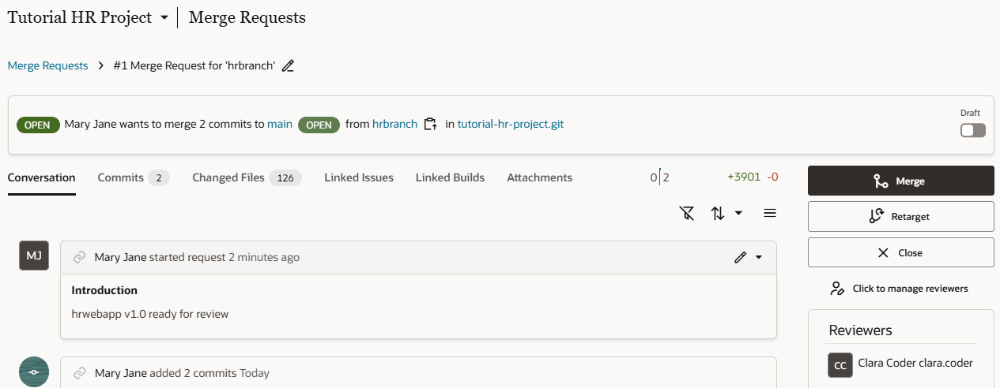

# Publish a Web App

## Introduction

This lab shows you how to publish your web app by merging your changes to the project's default branch.

Estimated Time: 15 minutes

### About this Lab
When the process of reviewing your HR web app is done, you are ready to publish the application and make your changes public. Publishing saves your application's code to a remote branch and then to the project's default (`main`) branch. You can use the **Commit** and **Push** Git options in your workspace to save your changes to a remote branch (as we did in a previous lab), then use the **Merge** option to push your changes to `main`. Or, you can do all of this at the click of a single **Publish** button (as we'll do in this lab).

No matter how you decide to save your changes, it's a good idea to always get your code reviewed and approved before you merge it to the project's `main` branch. Because the `main` code base is meant to be stable, it is usually protected, requiring code to be reviewed through a merge request. If your project was set up to protect the `main` branch, merging your changes will require approval. In this lab, you'll create a merge request to review your changes, but for demonstration purposes, you'll merge the code to the `main` branch without approval.

Once your changes are successfully merged, VB Studio automatically deploys the web app to your environment's VB instance and creates a permanent URL to access the application.

### Objectives
In this lab, you will:
* Create a merge request to publish your changes
* Merge your changes and view the deployed application
* Import data to your deployed application

### Prerequisites

This lab assumes you have:
* A Chrome browser
* All previous labs successfully completed

## Task 1: Create a merge request for approval

Now that you are ready to publish your changes to the project's `main` branch, let's create a merge request to get someone to sign off on your changes.

1.  Click **Workspaces**, then **HR Visual Application** in the Workspaces table.
2.  When your workspace opens, click **Publish** in the header.
3.  In the Publish Changes dialog box, click **Merge After Review**.
4.  Enter a message for your commit, select another project member as a reviewer, and click **Publish Changes**. 

    

    Once the request to merge your changes from `hrbranch` to `main` is created, click **Close**. Both your reviewer and you will be notified that a new merge request has been created.

    

5.  Return to the project home, then click **Merge Requests**  in the left navigator. You'll see your merge request listed here. For a quick summary of the merge request, click **Details** .
6.  Click **#1 Merge Request for branch 'hrbranch'**. All details of the merge request, including its current status and all previous commits, will be shown:

    

    You can't create another merge request from your workspace until your changes are merged, but you can use the **Commit** and **Push** options in the header's Git repository menu to update a merge request that's pending approval.

## Task 2: Merge changes to the default branch

Assuming your merge request has been approved, let's now merge your changes to the project's `main` branch in the remote repository.

1.  Click **Merge** on the Merge Requests page.
2.  In the Merge dialog, enter a message, select **Delete branch** if you want to delete the branch after the merge, and click **Create a Merge Commit**.

    

    The merge request shows as Merged. If you didn't choose to delete the branch, you can do so now if you want.

    Once your changes are merged, VB Studio automatically triggers the package and deploy jobs in your pipeline to deploy your web application to the development environment. Click **Builds** to view the progress of your build jobs.

    

## Task 3: View the deployed application
After your application is successfully deployed to the development environment, you can view it from your environment's list of deployments.

1.  In the left Navigator, click **Environments** , then **Deployments**.
2.  Expand the **tutorial-hr-project** that shows the **Deployed** status, then click the **hrwebapp** application.

    

    The application opens in a new browser tab, but without any data. While you can use an empty database in your development environment, we'll see how to import data for the application in the next step.

## Task 4: Import data to the deployed application
A deployed application does not automatically include its business object data, so you'll need to manually import data for the application in the development environment. You can import the data you used in your workspace or add entirely different data, as we'll do now.

1.  Click [this link](https://objectstorage.us-ashburn-1.oraclecloud.com/p/CSv7IOyvydHG3smC6R5EGtI3gc1vA3t-68MnKgq99ivKAbwNf8BVnXVQ2V3H2ZnM/n/c4u04/b/livelabsfiles/o/solutions-library/HR_Application.zip) and download the `HR_Application.zip` file. The zip file contains CSV files of the Location, Department, and Employee business objects with more records and data.
2.  In the Environments page, click **Actions**  for the deployed tutorial-hr-project and select **Import Data**.

    

3.  In the Import Data dialog box, click the upload box, select the `HR_Application.zip` file you previously downloaded, and click **Import Data**.

    

    When the import succeeds, click **Close**.

4.  Refresh the **hrwebapp** application that you opened previously in a browser tab.

    The application displays the newly imported data. You can now make a note of this URL to share with public users.  Remember to close the browser tab when you're done using the application.

    If you now want to make changes to your application, you'll need to create a new branch off your project's `main` branch. You can do this in your existing workspace using the **Switch Branch** option in the Git repository menu. You can also clone this repository in a new workspace using the **Clone From Git** option on the Workspaces page and start afresh.

## Acknowledgements
* **Author** - Sheryl Manoharan, VB Studio User Assistance, November 2021
* **Last Updated By/Date** - Sheryl Manoharan, February 2022
