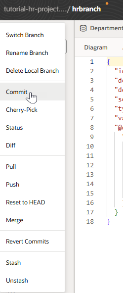
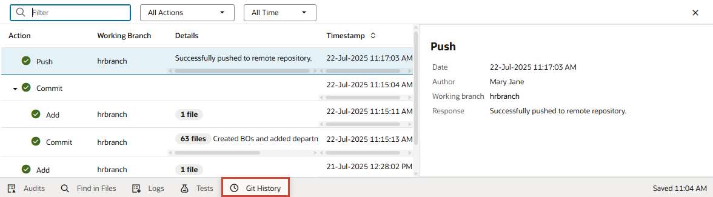
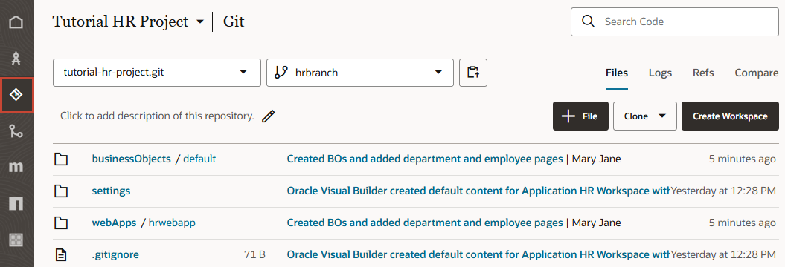

# Save a Web App's Changes to a Remote Branch

## Introduction

This lab shows you how to save a web application's changes from your local branch to a remote branch, so others can view your work.

Estimated Time: 10 minutes

### About this Lab
While developing the HR web application, you might have noticed a yellow dot in the header next to your Git repository:

This dot indicates you've made changes in your local branch that haven't been saved to the remote branch. It's important to save your changes as often as you can, but first, let's review a few concepts.

When you first created a workspace, you created a new branch called `hrbranch`, which was a copy of the default branch (`main`) in the project’s Git repository and contained the same set of source files. Since then, all the changes you've made to the HR web app have been automatically saved to `hrbranch`, but these changes are not visible to others because `hrbranch` is local to your workspace. To let others view your changes, you'll need to save your changes from the local branch in your workspace to a branch in a remote repository.

Saving changes to a remote branch is a two-step process: _commit_ and _push_. The first step you'll do is "commit". A commit groups the files in your local branch that you want to save to the remote branch and provides a description of the group. Next, you'll "push" your changes. A push saves all the files in the groups that you've "committed" to the remote branch.

Once you commit and push your changes, all the changes from your local `hrbranch` become available to others in your project through the remote `hrbranch`.

### Objectives
In this lab, you will:
* Commit your changes to the local repository
* Push your changes from the local to the remote repository

### Prerequisites

This lab assumes you have:
* A Chrome browser
* All previous labs successfully completed

## Task 1: Commit changes in a local branch
Let's group the changes you've made so far in your local branch for a commit. Ideally, you'll commit your changes as often as you can, so you have a string of commits with messages that clearly describe your updates.

1. Click the Git repository menu in the header and select **Commit**.

  

2. In the Commit dialog box, enter a message that describes your changes and click **Commit**.

    

    A successful message appears on the page. Click  to close the message.

## Task 2: Push changes to a remote branch

Push your commits from the local branch in your workspace to the remote branch.

1.  Click the Git repository menu and select **Push**.
2.  In the Push dialog box, you'll see 1 commit ready to be pushed from your local branch to the remote branch. Click **Push Changes**.

    

    When the successful message appears, click .

## Task 3: View changes in the remote branch

Now that your changes have been pushed, let's check them in the remote `hrbranch`.

1. Click **Git History** at the bottom of your application window to view a summary of your push operation.

   

   The Git History panel logs your Git actions and their results and is useful to keep track of what you've done in your workspace. Click  when you are done.

2.  Now click **Go to project page**  in the header to return to the project's home page.

3.  Click **Git**  in the left navigator.

   You'll see your changes added to the remote `hrbranch`, indicated by your last commit message.

    

    Click **Logs** to see all commits to the remote branch.

    

    Now if a teammate (for example, Clara Coder) wanted to work on this web application, she could use the **Clone From Git** option on the Workspaces page to clone `hrbranch` in her workspace, then use it as a base for her updates.

    You may **proceed to the next lab**.

## Acknowledgements
* **Author** - Sheryl Manoharan, VB Studio User Assistance, November 2021
* **Last Updated By/Date** - Sheryl Manoharan, February 2022
