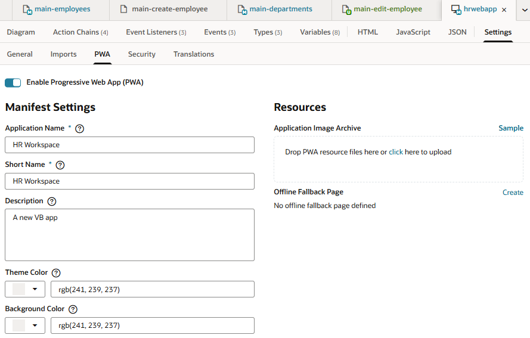
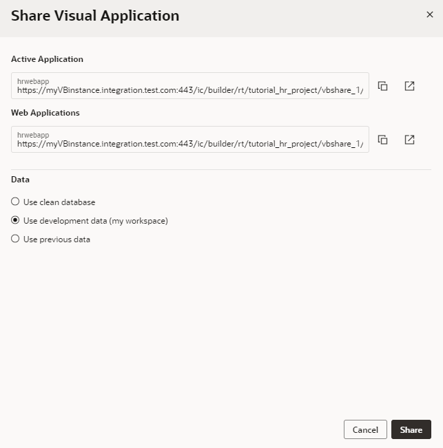
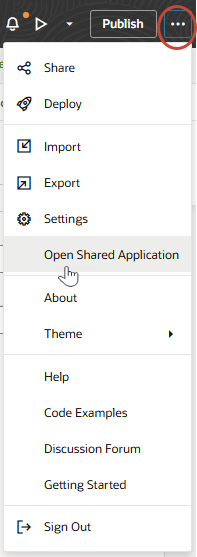
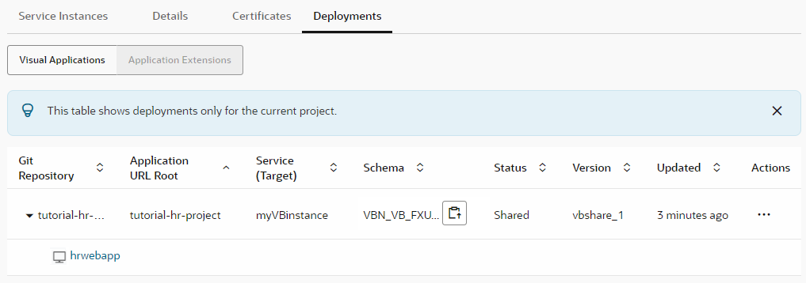

# Share a web app

## Introduction

This lab shows how you can share your web app with others using VB Studio.

Estimated Time: 10 minutes

### About this Lab

At this point, your work designing and developing the HR web application is more or less complete. You can now share the application with your team and ask for feedback.

Sharing an application, much like the preview option you've used in previous labs, lets you try out the application without committing its code to the project's Git repository (in this case, the changes you've made since your last push). But unlike a preview, which is visible only to you, a share action deploys your application to the VB instance associated with your development environment and creates a URL that you can pass along to your team. Your team can then test the behavior of your shared application and identify where it can be improved.

You can share your application as many times as you want to let your teammates test your changes and make sure the application works as expected.

### Objectives

In this lab, you will:

* Enable your web app as a PWA
* Share your app
* Get the shared app's URL to share with team members

### Prerequisites

This lab assumes you have:

* A Chrome browser
* All previous labs successfully completed

## Task 1: Enable the web app as a PWA

Before you share your app, let's enable it to run as a Progressive Web App—or PWA for short. PWAs are designed to be capable, reliable, and provide a platform-specific look and feel. When you enable a web app as a PWA, it can be installed directly from a browser on a user's device, including Android and iOS mobile devices.

1. In the Web Apps pane, click the **hrwebapp** node.

2. Click **Settings** and **PWA**, then toggle **Enable Progressive Web App (PWA)**.

    

3. Review the **Manifest Settings** included with the PWA's web manifest, a JSON file that contains information about your application:

    * Change the **Application Name** to **HR App**. This name is displayed when you are prompted to install the application.

    * Change the **Short Name** to **HR App**. When both the application name and short name are specified, the short name is used on the home screen, launcher, and other places where space is limited.

    * Update the **Description** to **HR employee app**.

    * Accept the default values for the **Theme Color** and **Background Color**.

4. Under **Resources**, click **Create** next to **Offline Fallback Page** to add a page that is displayed when the user performs an action in the PWA that requires a connection, but the device is offline.

    

  A default **offlinePage.html** is created for you. You can click this page to customize its code, if you want. For demonstration purposes, we'll accept the default settings.

## Task 2: Share the application

Let's now share the application so your team can test its behavior.

1. Click **Menu**  in the header and select **Share**.

    

2. In the Share Visual Application dialog box, you'll see the URL that the hrwebapp will be shared to. (If you want, you can click the Copy icon to copy this URL, but we'll see how to get the URL after the application is shared.) Select **Use development data (my workspace)** to copy Department, Location, and Employee data from your workspace to your development environment's VB instance. Click **Share**.

    

    A brief confirmation appears, and the application is deployed to your VB instance.

## Task 3: View the shared application

Now that you've shared your application, you need to get its URL so you can pass it along to your team. You do this by opening the application itself, or by copying the URL when you shared the application. Remember that your team members will need the proper credentials to view your shared application.

1. Click **Menu**  and select **Open Shared Applications**. If the option does not appear or is not active, it means your application is not yet fully deployed. Wait a while and try again.

    

    The shared application opens in a new browser tab. It includes all the changes you've made in your workspace, even those that were not pushed to the remote branch; it also displays data from your workspace.

    An **Install HR App**  icon that lets you install the app as a PWA also shows up on the address bar—we'll see how this works in a later lab.

    

2. Make a note of the application's URL to share with your team, then close the browser tab.
3. To view the same shared application now deployed to your development environment, click **Go to Project page**  in the header, then click **Environments**  and **Deployments**. Expand **tutorial-hr-project** to view the shared application in your list of deployments.

    

    If you click **hrwebapp**, the application opens in a new browser tab, similar to the shared application view from within the Designer. When you've finished using the application, close the browser tab.

    Project team members like Clara Coder can also open the shared application from the list of deployments, as long as their membership includes access to the Environments page.

    You may **proceed to the next lab**.

## Acknowledgements

* **Author** - Sheryl Manoharan, VB Studio User Assistance, November 2021
* **Last Updated By/Date** - Sheryl Manoharan, May 2023
