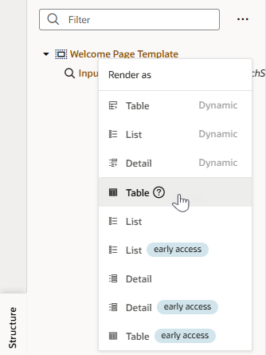

# Connect to data

## Introduction

Now that we've created the UI for our App UI, it's time to connect the extension to data that lives in Oracle Cloud Applications.

Estimated Time: 5 minutes

### About this lab

Oracle Cloud Applications provides REST-based access to its data. In this lab, we'll use the service catalog in VB Studio to browse available REST services, pick one, then display data from it on the page. You'll also test the App UI to make sure it's working correctly.

### Objectives

In this lab, you will:

* Create a service connection to access Oracle Cloud App data
* Display data in the App UI's page and set up filtering
* Test the App UI

### Prerequisites

This lab assumes you have all previous labs successfully completed.

## Task 1: Create a service connection

Create a connection to the Oracle Human Capital Management (HCM) services catalog to display employee data on the main-start page.

1. Click  **Services** in the Navigator.

2. In the Services pane, click **+ Service Connection**.

    

3. In the **Select Source** screen of the Service Connection wizard, click **Select from Catalog**.

4. Click the **Human Capital Management** tile.

    

5. In the **Create Service Connection** screen, enter `hcmRest` as the Service Name.

6. In the **Filter Objects/Endpoints** text box, enter `work`, then select **publicWorkers** from the search results.

    

7. Click **Create**.

    Now we can use this service connection to create the list of employees we want.

## Task 2: Display data and set up filtering

Display a list of employees based on data we get from HCM, then set up a mechanism to filter the list based on the employee's display name. We want to compare each name to whatever the user enters as a search string, in order to find the proper match.

1. Switch to the main-start page. Click the **main-start** tab just below the header, or click  **App UIs** in the Navigator and select **main-start** under the **empsearch** and **main** nodes.

2. Select the **Data** tab in the Page Designer, then expand **Services** and **hcmRest**.

    

3. Drag **publicWorkers** into Structure view and drop it on the **Welcome Page Template**, then select **Default** in the slots pop-up.

    

4. When shown options to display the data, select **Table** (not Table Dynamic or Table early access).

    

5. In the Add Data wizard, the **Endpoint Structure** panel shows all the fields that are available for us to choose from in the **publicWorkers** object. Use the Filter and select the **DisplayName**, **PhoneNumber** and **LocationTownOrCity** fields to show as table columns. Click **Next**.

    

6. In the **Define Query** screen, select **filterCriterion** in the **Target** panel.

    

7. At the bottom of the page, click **Click to add condition**.

8. Set up the condition as follows:

    * **Attribute**: DisplayName (Select the **DisplayName** attribute that's not part of the assignments list.)
    * **Operator**: contains ($co)
    * **Value**: $variables.searchString

    

9. Click **Done**, then **Finish**.

    The main-start page should filter and display a list of employees in a table:
    

## Task 3: Test the App UI

Test your App UI to make sure it's working as expected.

1. Click  **Preview** in the header.

2. When the App UI opens in a new browser tab displaying a list of employees, enter criteria in the **Emp Name** field to filter the list. Here's what you may see when you filter for employees with the first name `David`:

    

3. Close the browser tab.

You may now **proceed to the next lab**.

## Acknowledgements

* **Author** - Sheryl Manoharan, VB Studio User Assistance, May 2023
* **Last Updated By/Date** - Sheryl Manoharan, July 2025
