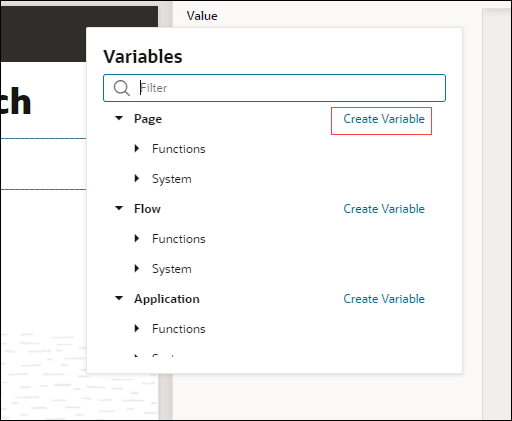
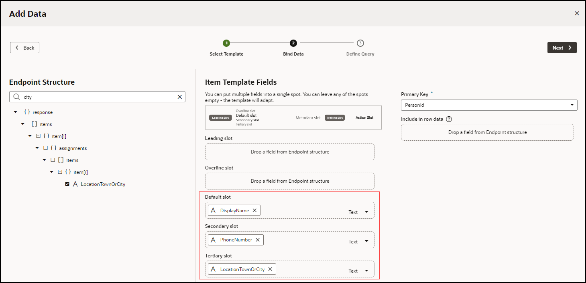

# Create an App UI and Connect to Data

## Introduction

In this lab, we'll build a simple App UI that allows users to search for an employee, based on data that we'll get from Human Capital Management (HCM).

## Task 1: Create an App UI

Start by creating an App UI in the form of VB Studio pages and flows.

1. In the **App UIs** pane, click **+ App UI**:

    

2. In App UI Name, enter the name of the application, perhaps something like HCMSearch. The App UI ID is automatically filled in, but you can change it if you'd like.  Click **Create**.

3. In the App UIs pane, expand the **main** node, and click **main-start** to open the page in the Designer.

4. In the Components palette, enter **heading** in the filter field to locate the Heading component, then drag and drop it onto the canvas.

5. In the Heading's Properties pane, enter **Employee Search** in the Text field:

    

6. In the Components palette, filter to find the **Input Text** component, then drag and drop it under the header on the canvas. Make sure you see the plus sign (+) before you drop the component, so you know you're working in a valid area:

    

7. In the Input Text component's Properties pane, change the **Label Hint** to `Emp Name`. You'll see this as placeholder text in the component on the canvas.

8. Let's now create a variable that we can map the input text field to. The variable will hold the employee data that the user will be able to search. In the component's Properties pane, click the **Data** tab. Hover over the **Value** text and click the  **Select Variable** icon next to **fx**.

9. Click **Create Variable** next to **Page**:

    

10. In the **ID** field, enter `searchString` and click **Create**.

## Task 2: Connect to a Data Source

Below the input text field, we want to show a list of employees that the user can choose from. To do this, we need to establish a service connection to Oracle Human Capital Management (HCM) so we can get the data we need.

1. Click **Services**  in the Navigator.

2. In the Services pane, click **+ Service Connection**:

    

3. In the **Select Source** screen of the Service Connection wizard, click **Select from Catalog**.

4. Click the tile for **Human Capital Management** in the **Service Catalog**:

    

5. In the **Create Service Connection** screen, enter `work` in the search box, then select **publicWorkers** from the search results:

    

6. Click **Create**.

    Now we can use this service connection to create the list of employees we want.

## Task 3: Set Up Filtering

In this task, we're going to set up a filtering mechanism for our list based on the display name of the employee. We want to compare each name to whatever the user enters as a search string, in order to find the proper match.

1. Click **App UIs**  in the Navigator and select **main-start**.

2. Select the **Data** tab in the Page Designer, then expand **Services** and **site_HCMSearch:hcmRest**. Drag **publicWorkers** onto the page underneath the Input Text component:

    

3. When prompted with a list of options for presenting the data, choose the second **List** item:

    

4. In the Add Data wizard, accept the default template in the **Select Template** screen and click **Next**:

    

5. In the Bind Data screen, the Endpoint Structure panel shows all the fields that are available for us to choose from in the **publicWorkers** object. Drag and drop each of these fields from this panel to the **Item Template Fields** section as specified, using the search field to help you locate them:

    * **Default slot**: DisplayName
    * **Secondary slot**: PhoneNumber
    * **Tertiary slot**: LocationTownOrCity

    

6. Click **Next**.

7. In the **Define Query** screen, select **filterCriterion** from the **Target** panel.

8. At the bottom of the page, click **Click to add condition**.

9. Set up the condition as follows:

    * **Attribute**: DisplayName (Select the **DisplayName** attribute that's not part of the assignments list.)
    * **Operator**: contains ($co)
    * **Value**: $variables.searchString

    

10. Click **Done**, then **Finish**.

You may **proceed to the next lab**.