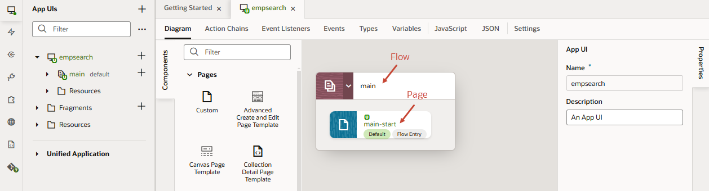
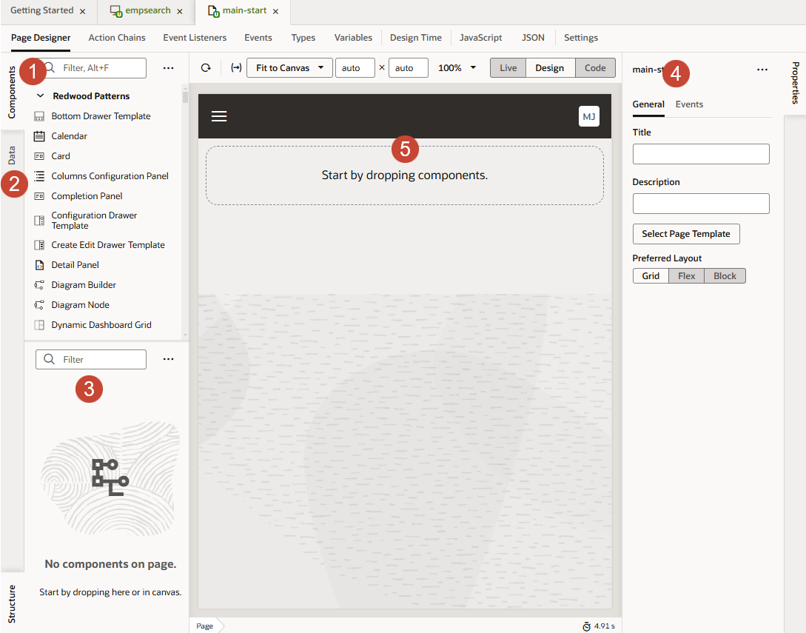
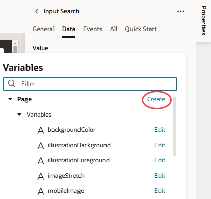

# Create an App UI and connect to data

## Introduction

We're now ready to build a simple App UI that allows users to search for an employee, based on data that we'll get from Human Capital Management (HCM).

Estimated Time: 10 minutes

### Objectives

In this lab, you will:

* Create an App UI
* Connect your extension to Oracle Cloud App data
* Set up the App UI to filter and display data

### Prerequisites

This lab assumes you have all previous labs successfully completed.

## Task 1: Create an App UI

Start by creating an App UI that takes the form of VB Studio pages and flows.

1. In the **App UIs** pane, click **+ App UI**:

    

2. In **App UI Name**, enter a name, perhaps something like `HCMSearch`. The App UI ID is automatically filled in, but you can change it if you like.

3. Click **Create**.

    The App UI opens on the Diagram view, which shows the App UI's flows and pages. A flow is just a way to keep related pages together. An application can contain multiple flows, and a flow can contain many pages. In this case, we have one flow, **main**, and one page, **main-start**:
    

4. Double-click the **main-start** tile to open the page in the Page Designer.

    What you see under the **main-start** tab is your main work area. Just under **main-start** are several horizontal tabs: Page Designer, Action Chains, Event Listeners, and so on. Each tab provides editors to help you examine and modify artifacts used in the page. By default, the page opens in the Page Designer, which is where you'll do the bulk of your work in VB Studio.
    

    Here are the main Page Designer areas you'll use throughout this workshop:
    | # | Tab | Functionality |
    | --- | ---- | --- |
    | 1 | Components | UI components (sorted by categories) that you can drag and drop onto a page|
    | 2 | Data | Endpoints you can work with, based on service connections you create to data objects |
    | 3 | Structure | Hierarchical view of the page's structure  |
    | 4 | Properties | Properties of a component selected on the page |
    | 5 | Canvas | A design, live, or code view of your page's content |
    {: title="Page Designer Work Area"}

    You can collapse and expand tabs to better manage your working area. For example, click **Properties** to hide the Properties pane and expand your work area. You can also move different panes to customize your work area. For example, right-click **Structure** at the bottom of your work area, then select **Move to Top Left** to move the Structure view right under Components and Data. Right-click the tab again and select **Reset All Panels to Default** to revert your change.

## Task 2: Add components to a page

Let's now develop our App UI by dragging and dropping components onto the main-start page.

1. In the Components palette, enter **heading** in the Filter field to locate the Heading component, then drag and drop it onto the canvas.

2. In the Heading's Properties pane, change the **Text** to `Employee Search`:

    

3. In the Components palette, filter to find the **Input Text** component, then drag and drop it under the header on the canvas. Make sure you see the plus sign (+) before you drop the component, so you know you're working in a valid area:

    

4. In the Input Text component's Properties pane, change the **Label Hint** to `Emp Name`. You'll see this text appear as a placeholder in the component on the canvas.

5. Let's now map the input text field to a variable, which will hold the data of the employee that the user will search for. In the Input Text component's Properties pane, click the **Data** tab, hover over the **Value** text, and click  next to **fx**.

    

6. When the variable picker opens, click **Create** next to **Page**.

7. In the **ID** field, enter `searchString`, leave the **Type** set to `String`, and click **Create**.

    The component's data is now bound to the newly created variable.

## Task 3: Connect to a data source

Below the input text field, we want to show a list of employees that the user can choose from. To do this, we need to connect to the Oracle Human Capital Management (HCM) service connections catalog, so we can get the data we need.

1. Click  **Services** in the Navigator.

2. In the Services pane, click **+ Service Connection**:

    

3. In the **Select Source** screen of the Service Connection wizard, click **Select from Catalog**.

4. Click the **Human Capital Management** tile:

    

5. In the **Create Service Connection** screen, enter `hcmRest` as the Service Name.

6. In the **Filter Objects/Endpoints** text box, enter `work`, then select **publicWorkers** from the search results:

    

7. Click **Create**.

    Now we can use this service connection to create the list of employees we want.

## Task 4: Set up filtering

In this task, we're going to set up a filtering mechanism for our list based on the display name of the employee. We want to compare each name to whatever the user enters as a search string, in order to find the proper match.

1. Switch to the main-start page. Click the **main-start** tab just below the header, or click  **App UIs** in the Navigator and select **main-start** under the **hcmsearch** and **main** nodes.

2. Select the **Data** tab in the Page Designer, then expand **Services** and **hcmRest**. Drag **publicWorkers** onto the page underneath the Input Text component:

    

3. When prompted with a list of options for presenting the data, choose the second **List** item:

    

4. In the Add Data wizard, accept the List Item Layout selected by default in the **Select Template** screen and click **Next**:

    

5. In the Bind Data screen, the **Endpoint Structure** panel shows all the fields that are available for us to choose from in the **publicWorkers** object. Drag and drop each of these fields from this panel to the **Item Template Fields** section as specified, using the Filter field to locate them:

    * **DisplayName**: Default slot
    * **PhoneNumber**: Secondary slot
    * **LocationTownOrCity**: Tertiary slot

    

6. Click **Next**.

7. In the **Define Query** screen, select **filterCriterion** in the **Target** panel.

8. At the bottom of the page, click **Click to add condition**.

9. Set up the condition as follows:

    * **Attribute**: DisplayName (Select the **DisplayName** attribute that's not part of the assignments list.)
    * **Operator**: contains ($co)
    * **Value**: $variables.searchString

    

10. Click **Done**, then **Finish**.

    The main-start page should filter and display a list of employees in a List View component:
    

You may now **proceed to the next lab**.

## Acknowledgements

* **Author** - Sheryl Manoharan, VB Studio User Assistance, May 2023
* **Last Updated By/Date** - Sheryl Manoharan, October 2024
