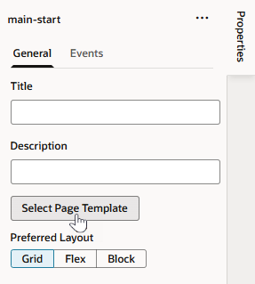

# Create an App UI

## Introduction

We're now ready to build a simple App UI that allows users to search for an employee.

Estimated Time: 5 minutes

### About this lab

An App UI is an application that takes the form of VB Studio flows and pages. Pages within the App UI take shape within the Designer, a rich graphical user interface that lets you design and develop your app by dragging and dropping components on a page. These components—all based on the open-source Oracle JavaScript Extension Toolkit (JET)—enable you to create rich UIs that span multiple devices.

You also have access to page templates based on Redwood, the Oracle standard for user experience. Redwood page templates include a rich set of user interface elements and provide a consistent look and feel across your app's pages. They also provide a responsive user experience, which means your app will adjust to the device accessing it.

### Objectives

In this lab, you will:

* Create an App UI
* Change the App UI's page to use a Redwood template
* Add components to the App UI page

### Prerequisites

This lab assumes you have all previous labs successfully completed.

## Task 1: Create an App UI

Start by creating an App UI.

1. In the **App UIs** pane, click **+ App UI**.

    

2. In **App UI Name**, enter a name, perhaps something like `EmpSearch`. The App UI ID is automatically filled in, but you can change it if you like. Take care to retain the `x-` prefix, which is used to distinguish customer App UIs from those created by Oracle in case they have the same name.

3. Click **Create**.

    The App UI opens on the Diagram view, which provides a visual representation of the App UI's flows and pages. A flow is just a way to keep related pages together. An application can contain many flows, and each flow can contain many pages. In this case, we have one flow, **main**, and one page, **main-start**:
    

4. Double-click the **main-start** tile on the canvas to open the page in the Page Designer.

    What you see under the **main-start** tab is your main work area. Just under **main-start** are several horizontal tabs: Page Designer, Action Chains, Event Listeners, and so on. Each tab provides editors to help you examine and modify artifacts used in the page. By default, the page opens in the Page Designer, which is where you'll do the bulk of your work in VB Studio.
    

    Here are the main Page Designer areas you'll use throughout this workshop:

    | # | Tab | Functionality |
    | --- | ---- | --- |
    | 1 | Components | UI components (sorted by categories) that you can drag and drop onto a page|
    | 2 | Data | Endpoints you can work with, based on service connections you create to data objects |
    | 3 | Structure | Hierarchical view of components on the page  |
    | 4 | Properties | Properties of a component selected on the page |
    | 5 | Canvas | A design, live, or code view of your page's content |
    {: title="Page Designer Work Area"}

    You can collapse and expand tabs to better manage your working area. For example, click **Properties** to hide the Properties pane and expand your work area. You can also move different panes to customize your work area. For example, right-click **Structure** at the bottom of your work area, then select **Move to Top Left** to move the Structure view right under Components and Data. Right-click the tab again and select **Reset All Panels to Default** to revert your change.

    Let's now configure the main-start page to leverage templates based on Redwood, the Oracle standard for user experience.

## Task 2: Change the Page Template

Change the main-start page to use a Redwood Welcome Page Template, allowing you to quickly create a search page using predefined components.

1. In the Page Designer, click **Properties** to open the main-start page's Properties pane, then click **Select Page Template**.

   

2. When the Page Templates dialog opens, scroll down and select **Welcome Page Template**. (If you don't see this template, go back to the first lab and make sure you set up all the project components.) Click **Select**.

   

3. In Structure view, click **Welcome Page Template** to view the template's properties.

   

4. In the template's Properties pane, click the **All** tab and modify these property values:

    | # | Property | Value |
    | --- | ---- | --- |
    | 1 | Page Title | **Employees**|
    | 2 | Description | **Search a list of employees** |
    | 3 | Background Color | Remove **[[ $page.variables.backgroundColor ]]** and select a color: dark-ocean, dark-pine, dark-lilac, dark-teal, dark-rose, dark-pebble, dark-slate, dark-plum, dark-sienna, auto  |
    | 4 | Illustration foreground source URL | https://static.oracle.com/cdn/fnd/gallery/2504.0.0/images/illust-welcome-banner-fg-03.png |
    {: title="Welcome Page Template Properties"}

    Your screen may look something like this:

   

## Task 3: Add a Search component

Let's now add an Input Search component that allows users to enter some search text on the main-start page.

1. In the Components palette, enter **search** in the Filter field to locate the Input Search component.

2. Drag and drop the component on the banner in the canvas area (you can also drop it onto the Welcome Page Template in Structure view). When prompted to pick a slot, select **Search slot**.

   

3. In the Input Search component's General tab in the Properties pane, enter  `Emp Name` as the **Placeholder**. You'll see this text appear as a placeholder in the component on the canvas.

4. Let's now map the input search field to a variable, which will hold the employee detail that the user will search for. Click the **Data** tab in the Properties pane, then hover over the **Value** text, and click  next to **fx**.

    

5. When the variable picker opens, click **Create** next to **Page**.

    

6. In the **ID** field, enter `searchString`, leave the **Type** set to `String`, and click **Create**.

    The component's data is now bound to the newly created variable.

You may now **proceed to the next lab**.

## Acknowledgements

* **Author** - Sheryl Manoharan, VB Studio User Assistance, May 2023
* **Last Updated By/Date** - Sheryl Manoharan, July 2025
