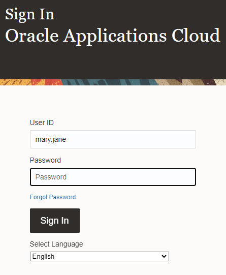
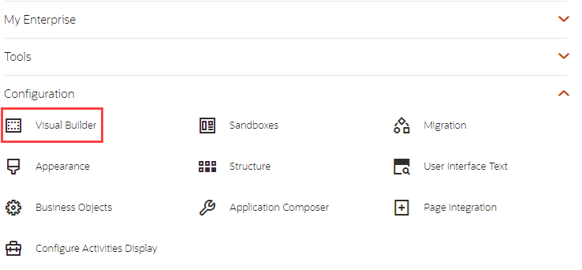
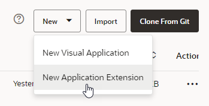
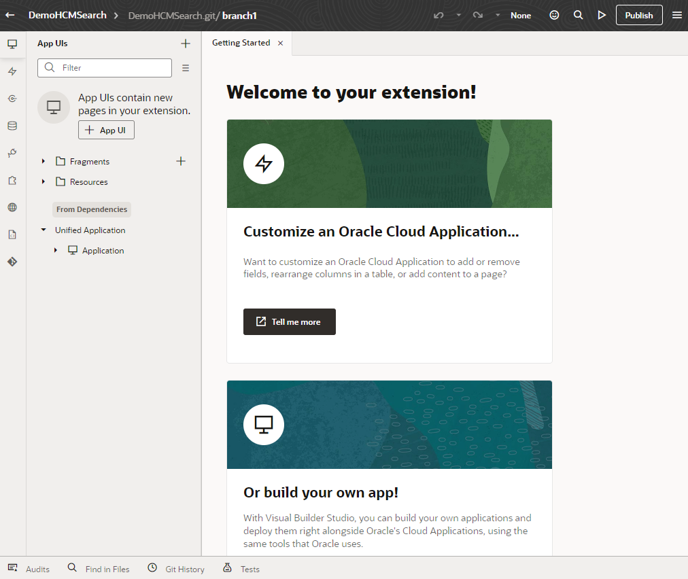

# Create an extension in Visual Builder Studio

## Introduction

Starting in Oracle Cloud Applications, we'll navigate to Visual Builder Studio and access a project where we can develop our extension.

Estimated Time: 5 minutes

### About this lab

To extend Oracle Cloud Applications in VB Studio, you must belong to a *project*. Every project in VB Studio is devoted to a discrete software effort, and the project you use in this lab is exclusive to your Oracle Cloud Application. The project brings together all the tools you need to create your App UI: a Git repository to store your source code, a pipeline to provide continuous integration and delivery, and more.

Within your project, you'll create a *workspace*, a completely private area for you to work on your application. The changes you make in your workspace are stored in a clone of the project's Git repository, and are not visible to others until you share or publish them.

### Objectives

In this lab, you will:

* Access VB Studio from your Oracle Cloud Application environment
* Create an extension (also considered a workspace) for your Oracle Cloud App

### Prerequisites

This lab assumes you have:

* An Oracle Cloud account
* All previous labs successfully completed

## Task 1: Access VB Studio from Oracle Cloud Applications

Users with [the right roles](https://docs.oracle.com/en/cloud/paas/visual-builder/visualbuilder-administration/set-vb-studio-extend-oracle-cloud-applications.html#GUID-4B6EF26F-46C6-40E5-A837-6188013B3C98) can access VB Studio from their Oracle Cloud Applications' TEST instance.

1. Log in to your Oracle Cloud Applications instance.
  

2. Click the menu  in the upper left corner, navigate to **Configuration**, then select **Visual Builder** (synonymous with VB Studio):
  

3. When VB Studio opens on the Organization page, select the project you want to use to develop extensions for your Oracle Cloud Application.

  If you don't have a project, [follow these instructions](https://docs.oracle.com/en/cloud/paas/visual-builder/visualbuilder-administration/set-vb-studio-extend-oracle-cloud-applications.html#GUID-E1303FFC-767A-4D87-B914-DE7B520AE799) to create one.

## Task 2: Create a workspace for your extension

Once you have your project, create a workspace where you can develop your extension. A workspace is your ticket into the Designer, a visual environment that lets you design and develop your user interface by dragging and dropping components on a page.

1. In the VB Studio navigation menu, click the **Workspaces**  tab.

2. Click **New** and select **New Application Extension**:
  

3. In the **New Application Extension** dialog, populate the fields with these values:

  | Field | Value | Explanation |
  | --- | --- | --- |
  | Extension Name | YourName-HCMSearch | To keep the names distinct, use your first name and the initial of your last name, as in `JohnD-HCMSearch` |
  | Extension ID | site_YourName-HCMSearch | Automatically filled in, but you can change it if you like |
  | Workspace Name | YourName-HCMSearch | Automatically filled in, but you can change it if you like |
  | Development Environment | Development | Mapped to your current identity domain's Oracle Cloud Applications instance |
  | Base Oracle Cloud Application | None | Not needed in this scenario |
  | Sandbox | No sandbox selected | Not needed in this scenario |
  | Create new repository | Select | Creates a Git repository and branch where your extension's files will be stored |
  | Repository Name | YourName-HCMSearch | Name of the extension's Git repository |
  | Working Branch Name | branch1 | Working copy of your Git repository's default branch |
  {: title="New App Extension Fields"}

  Here are the values used for demo purposes in this workshop:
  
4. Click **Create**.

  VB Studio opens your workspace in the Designer, where you can get started with developing your App UI.

## Task 3: Explore your extension

1. When your workspace first opens in the Designer, your screen might look something like this:
  

    * On the far left are icons representing App UIs, Services, Dependencies, and so on. This vertical toolbar is the Navigator, which helps you move between the artifacts in your extension.

    * The App UIs pane is where you'd get started with App UIs (entire pages and flows) or fragments (reusable pieces of UI). You'll also see a section called **From Dependencies** with the **Unified Application** listed under. The Unified App provides global services and a common user interface shell to all App UIs. You won't need to worry about this underpinning, but suffice to say it is considered a dependency for everything in the Oracle Cloud Applications ecosystem.

2. Now take a look at the header:
  

    * On the left is the name of your current workspace, **DemoHCMSearch**; next to it is the project's Git repository (**DemoHCMSearch.git**) and the branch currently associated with your workspace (**branch1**).

     The **DemoHCMSearch.git** repo stores your extension's files and is known as your project's *remote* repository. It includes the **main** and **branch1** branches, created with initial content for your extension. The **main** branch is the default branch created when a new repo is generated and is the project's source of truth. The **branch1** you see in your workspace is a working copy of your project's repo and serves as your *local* repository. It initially has the same set of source files as the remote branch, but will include the changes you make as you develop the extension.

    * Elements on the right let you perform various other actions, such as undo a change or search the Git repository for a file. This workshop primarily demonstrates the options to preview your App UI and publish changes. If you make a mistake during this workshop, click  to back out of the last step you did.

  Keep in mind that VB Studio saves your changes automatically as you work. A timestamp at the bottom of the page will show the time your work was last saved.

You may now **proceed to the next lab**.

## Acknowledgements

* **Author** - Sheryl Manoharan, VB Studio User Assistance, May 2023
* **Contributors** -  Lisa Dawson, VB Studio User Assistance
* **Last Updated By/Date** - Sheryl Manoharan, May 2023
