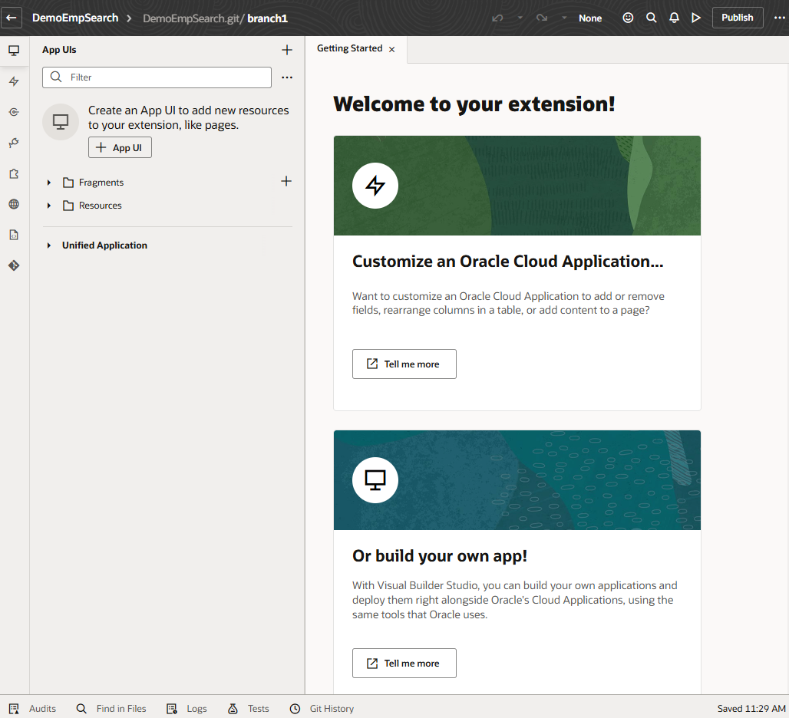

# Create an Extension in Visual Builder Studio

## Introduction

Starting in Oracle Cloud Applications, we'll navigate to Visual Builder Studio and access a project where we can develop our extension.

Estimated Time: -- minutes

### About this lab

To extend an Oracle Cloud Application in VB Studio, you must belong to a project. Every project in VB Studio is devoted to a discrete software effort, and the project you use in this lab is exclusive to your Oracle Cloud Application. The project brings together all the tools you need to create your App UI: a Git repository to store your source code, a pipeline to provide continuous integration and delivery, and more.

As part of your project, you'll also have access to a workspace, a completely private area for you to work on your application. The changes you make in your workspace are stored in a clone of the project's Git repository, and are not visible to others until you share or publish them. A workspace also connects you to the Oracle Cloud Applications environment where you deploy your extension.

### Objectives

In this lab, you will:

* Access VB Studio from your Oracle Cloud Application environment
* Create an extension for your Oracle Cloud App

## Task 1: Access VB Studio from Oracle Cloud Applications

Users with [the right roles](https://docs.oracle.com/en/cloud/paas/visual-builder/visualbuilder-administration/set-vb-studio-extend-oracle-cloud-applications.html#GUID-DF0D4F76-D26A-46B5-B8E5-68D7FDD1E475) can access VB Studio from their Oracle Cloud Applications' TEST instance.

1. Log in to your Oracle Cloud Applications instance.
  

2. Click the menu  in the upper left corner, navigate to **Configuration**, then select **Visual Builder** (synonymous with VB Studio):
  

3. When VB Studio opens on the Organization page, select a project that you can use for your Oracle Cloud Application.

  If you don't have a project, [follow these instructions](https://docs.oracle.com/en/cloud/paas/visual-builder/visualbuilder-administration/set-vb-studio-extend-oracle-cloud-applications.html#GUID-E1303FFC-767A-4D87-B914-DE7B520AE799) to create one.

## Task 2: Create a workspace for your extension

Once you have your project, create a workspace where you can develop your extension. A workspace is your ticket into the Designer, which is where you'll do the bulk of your work.

1. In the navigation menu, click **Workspaces** . Click **New**, then select **New Application Extension**:
  

2. In the **Extension Name** field, give your extension a name. The extension name must be unique, so you might want to use `HCMSearch`, prefaced by your initials. The **Extension ID** and **Workspace Name** are automatically filled in, but you can change them if you like.

3. In the **Development Environment** field, choose **Development**.

4. In the **Base Oracle Cloud Application** field, choose **None**.

5. In the **Git Repository** section, click **Create a new repository**, and add names for your repository and working branch:
  

6. Click **Create**.

  VB Studio opens your workspace in the Designer, where you can begin creating your App UI. Your screen might look something like this:
  

You may **proceed to the next lab**.

## Acknowledgements

* **Author** - Sheryl Manoharan, VB Studio User Assistance, May 2023
* **Last Updated By/Date** - Sheryl Manoharan, May 2023
