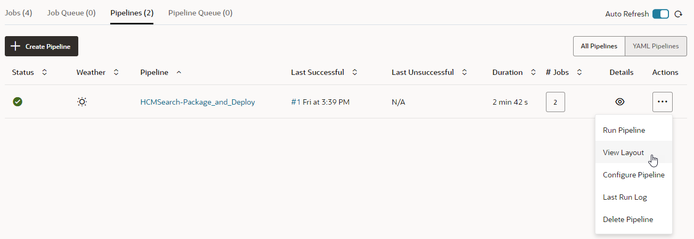

# Test and Publish the Application

## Introduction

Now that we have an App UI in our extension, we'll test the App UI's pages to make sure they're working correctly. We'll then publish the extension and view the App UI deployed to your Oracle Cloud Applications instance.

## Task 1: Test the App UI

1. Click **Preview** in the header to run the App UI in its own browser tab and see how it will appear to a user.

2. To filter the list, enter a search criteria, like the first name `David`:

    

3. After you've confirmed search is working, click **Publish** to publish your extension with its App UI.

    

4. In the Publish Changes dialog, enter a description of the changes in the **Commit Message** field, then click **Publish Changes**:

    

5. If prompted, provide your user name and password for your development instance. These **must** be Oracle Cloud Application credentials, as opposed to Visual Builder Studio or SSO credentials:

    

6. When the changes are published to your project's Git repository, click **Close**.

## Task 2: View the Deployed Extension

Once your changes are successfully merged, VB Studio automatically kicks off the packaging and deployment jobs to deploy the extension to your environment's Oracle Cloud Applications instance.

1. Click **Go to project page**  in the header to go to the Project Home page.

2. In the main navigation, click the **Builds**  tab to check the build jobs that package and deploy the extension to your development instance. If the build job is still running, you can view its progress in the **Job Queue** tab. It might take a few minutes for the build to start if an executor isn't immediately available.

    

    To view the sequence of build jobs, click the **Pipelines** tab, then select **View Layout** under the Actions menu  for the HCMSearch-Package and Deploy job.

    

3. Click the **Environments** tab in the Navigator and select the **Deployments** tab.

4. Click the **Application Extension** tab , then expand the **HCMSearch** extension:

    

5. Click **Open**  next to your App UI to open it in a new browser tab.

You may **proceed to the next lab**.
