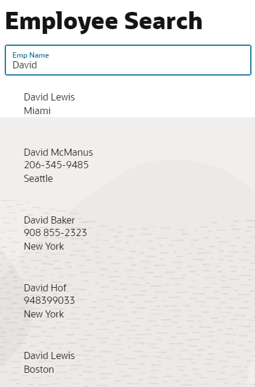
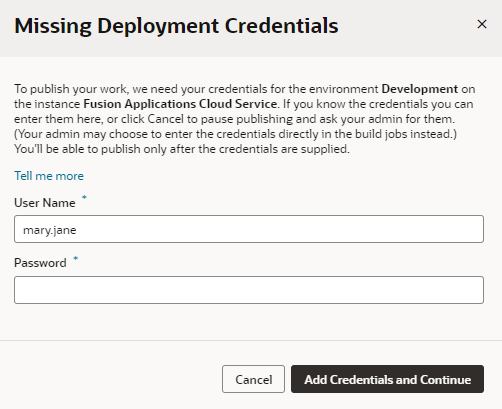
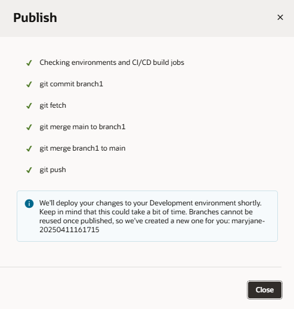
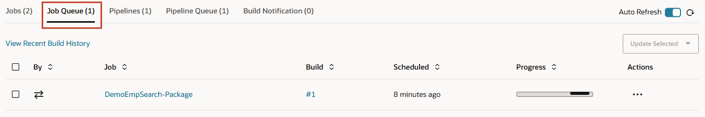

# Test and Publish the Application

## Introduction

Now that we've set up the App UI in our extension, we'll test it to make sure it's working correctly. We'll then publish the extension and view the App UI deployed to your Oracle Cloud Applications instance.

### Objectives

In this lab, you will:

* Test your App UI's pages
* Deploy your App UI's extension to your Oracle Cloud Application instance
* Access the deployed extension

## Task 1: Test the App UI

You can preview your App UI to run it in its own browser tab and see how it will appear to a user.

1. Click **Preview**  in the header.

2. When the App UI opens displaying a list of employees, enter criteria, like the first name `David`, in the **Emp Name** field to filter the list:

    

3. Close the browser tab.

## Task 2: Publish the extension

After you've confirmed search is working, you are ready to deploy the extension with its App UI to your Oracle Cloud Applications instance.

1. Click **Publish** in the header.

    

2. In the Publish Changes dialog, enter a description of the changes in the **Commit Message** field, then click **Publish Changes**:

    

3. If prompted, provide your user name and password for your development instance. These **must** be Oracle Cloud Application credentials, as opposed to Visual Builder Studio or SSO credentials:

    

4. When the changes are published to your project's Git repository, click **Close**.
    

## Task 3: View the deployed extension

Once your changes are successfully merged to your remote repo, VB Studio automatically kicks off the packaging and deployment jobs to deploy the extension to your environment's Oracle Cloud Applications instance.

1. Click  in the header to go to the Project Home page.

2. In the main navigation, click the **Builds**  tab to check the build jobs that package and deploy the extension to your development instance. If the build job is still running, you can view its progress in the **Job Queue** tab. It might take a few minutes for the build to start if an executor isn't immediately available.

    

3. Click the **Environments** tab, then select **Deployments**.

4. Expand the **Demo-HCMSearch** extension:

    

5. Click **Open**  next to your App UI to open it in a new browser tab.

<!-- You may **proceed to the next lab**. -->

## Acknowledgements

* **Author** - Sheryl Manoharan, VB Studio User Assistance, May 2023
* **Contributors** -  Lisa Dawson, VB Studio User Assistance
* **Last Updated By/Date** - Sheryl Manoharan, May 2023
