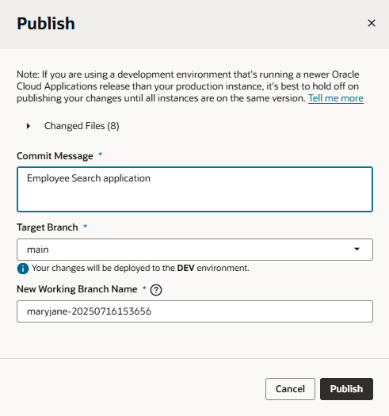
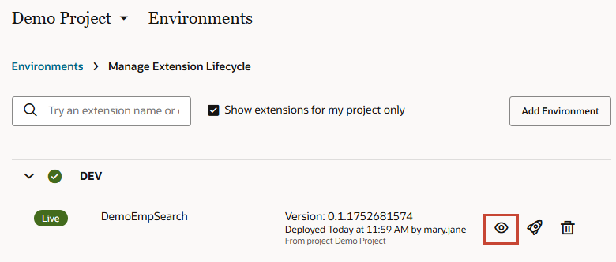
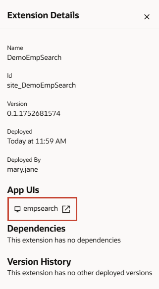

# Publish the extension

## Introduction

Now that we've tested the App UI in our extension, we're ready to publish the extension and view the App UI deployed to your Oracle Cloud Applications instance.

Estimated Time: 5 minutes

### About this lab

Publishing saves your application's code from the local branch in your workspace to the remote branch in the project's Git repository, then to the project's default branch (main). While it's possible to complete each of these Git operations separately, it's simplest to do all of this at the click of a single **Publish** button—as we'll do in this lab.

Once your changes are successfully merged, VB Studio automatically deploys them to your environment's Oracle Cloud Applications instance. Note that your changes are deployed *directly* to your Oracle Cloud Applications instance by default. This is the simplest, most straightforward approach to quickly see your changes. If you want others to review your changes as part of a merge request or you'd like to automate some lifecycle operations, you'll want to use CI/CD pipelines. See [Use CI/CD Pipelines for Deployment](https://docs.oracle.com/en/cloud/paas/visual-builder/visualbuilder-administration/set-ci-cd-pipelines-deployment.html) for details. For simplicity, this workshop only showcases direct deployment.

### Objectives

In this lab, you will:

* Deploy your App UI's extension to your Oracle Cloud Application instance
* Access the deployed extension
* (Optional) Manage the deployed extension

### Prerequisites

This lab assumes you have all previous labs successfully completed.

## Task 1: Publish the extension

After you've confirmed search is working, you are ready to deploy the extension with its App UI to your Oracle Cloud Applications instance.

1. Click **Publish** in the header.

    

2. In the Publish dialog, enter a description of your changes in the **Commit Message** field.

    

    Note the **New Working Branch Name**. Once you publish a branch, you can no longer use it, so VB Studio automatically creates a new working branch and switches your workspace to it for any future changes. It's recommended that you provide a more meaningful name for your new working branch.

    Click **Publish**.

3. Once your changes are merged to the project's **main** branch and deployed to your instance, click the link in the Publish dialog to access your Oracle Cloud Applications instance.
    

    **Note:** Make sure you copy and paste the deployment URL to your clipboard before you click **Close**. You won't have access to the URL after the Publish dialog is closed.

## Task 2: View your deployed extension

Access your environment's Oracle Cloud Applications instance to view your deployed extension.

1. When your Oracle Cloud Applications instance opens in a new browser tab, click the navigation menu  in the upper left corner.

2. Scroll down to the bottom and expand **Others**, then select **empsearch** (the App UI name).

    

    You can now view and experiment with the App UI on your Oracle Cloud Applications instance.

## Task 3: Manage your deployed extension

Once your extension is deployed, you can manage its lifecycle, say to deploy it to other environments or to delete it.

1. Switch to your VB Studio instance, click  in the Designer's upper right corner, and select **Extension Lifecycle**.

2. On the Manage Extension Lifecycle page, expand the **DEV** environment and click  to view extension details and access your App UI.

    

3. Use other available options as needed:
    * Click  to deploy your extension to other environments (you will first need to add another environment with an Oracle Cloud Applications instance).
    * Click  to delete the extension if it's no longer required.

    For details, see [Manage Your Published Extensions](https://docs.oracle.com/en/cloud/paas/visual-builder/visualbuilder-building-appui/manage-your-published-extensions.html).

    <!-- Now click  next to **empsearch** to open your App UI in a new browser tab.

     -->

Your work is now finished! Thank you for completing this workshop.

## Acknowledgements

* **Author** - Sheryl Manoharan, VB Studio User Assistance, May 2023
* **Last Updated By/Date** - Sheryl Manoharan, July 2025
