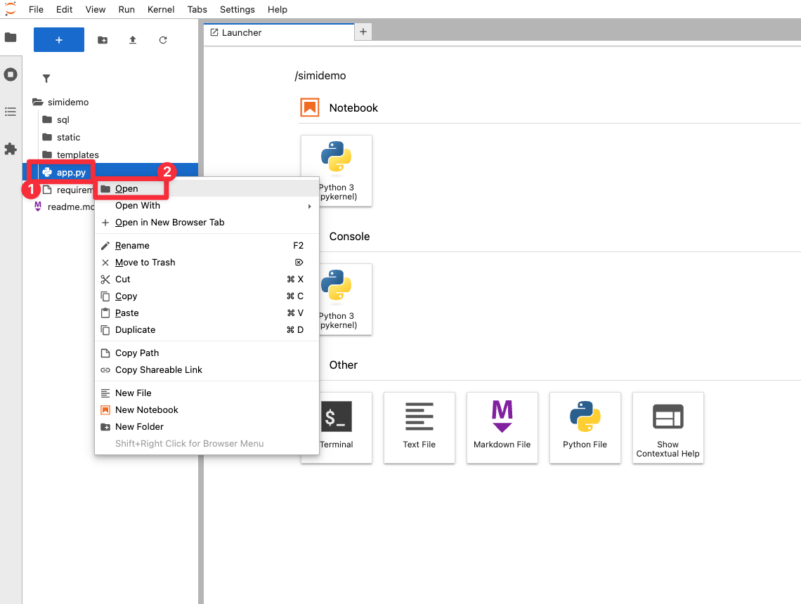
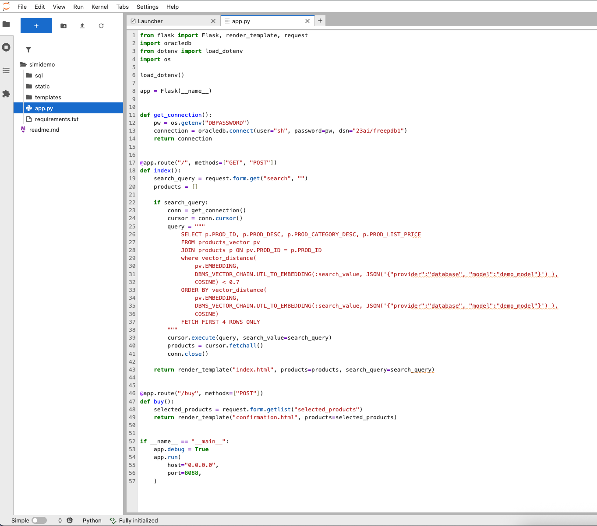
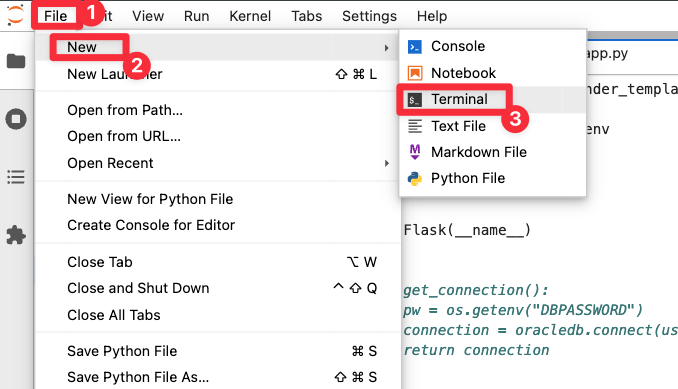
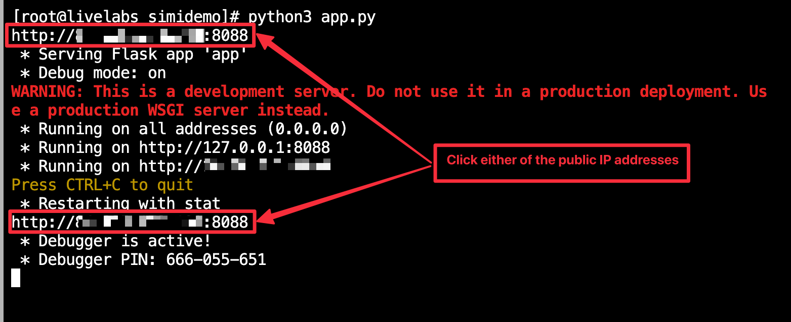
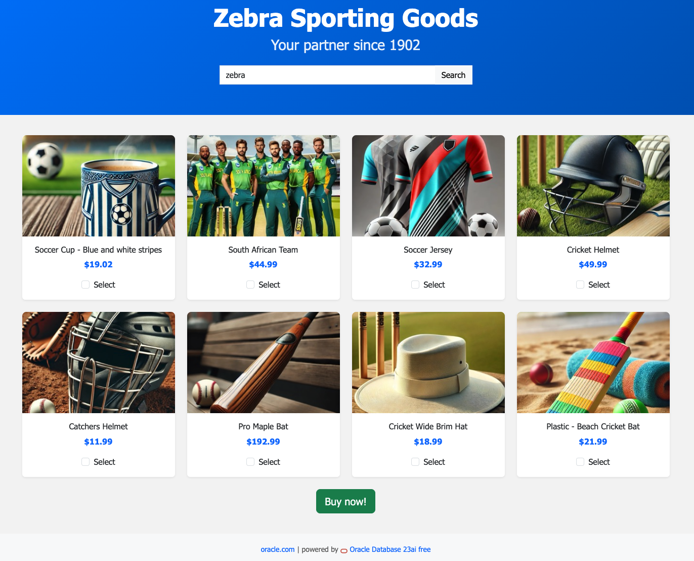

# Implement a Semantic Cache

## Introduction

Next, we want to enhance our application with Generative AI—ultimately, we want to improve the customer experience to encourage users to purchase a product. Our marketing team believes popular testimonials boost sales. We'll use Generative AI to create testimonials for each product page, enhancing customer experience and driving purchases.

One of the team members is concerned about the potential increase in costs associated with using Generative AI, for example, the cost per API call to the number of API calls. Also, the user experience in regard to performance is a concern: Each call to a LLM may cost a few seconds. We want to ensure that we can provide a good user experience while also minimizing costs.

In one of the architectural design meetings, you suggest implementing a **Semantic Cache**. This cache stores the semantic meaning of product descriptions and links them to testimonials. When users search products, the cache checks if we already have testimonial data—eliminating redundant API calls, boosting performance, and cutting costs.

Key Benefits of semantic caching:
* Performance: Avoids redundant LLM calls for similar queries
* Cost Efficiency: Reduces API usage and associated costs
* Semantic Intelligence: Matches similar meanings, not just exact text
* Save resources

Estimated Lab Time: 45 minutes

### Objectives

In this lab, you will:
* Implement Generative AI to create testimonials for product pages
* Deploy Semantic Cache architecture to solve performance and cost issues
* Improve the overall user journey to encourage product purchases
* Eliminate redundant LLM calls through intelligent semantic matching
* Create scalable infrastructure that maintains quality while reducing resource consumption

This lab assumes you have:
* An Oracle Cloud account
* All previous labs successfully completed


## Task 1: Open the application code

Let us first open the application code.

1. Open the **app.py** file in JupyterLab. Double-click on **app.py** in the file browser or right-click on it and select **Open**. 

    


   


## Task 2: Create the Semantic Cache

First, let's add a function to our code which will create a cache for our application. We will use this cache to store our LLM responses for later use. For this, we need a new table in the database.

1. Copy the following code and past it right after the get_connection() function in **app.py**:

    ```python
    <copy>
    def create_llm_cache_table():
        conn = get_connection()
        cursor = conn.cursor()

        create_table_sql = """
        CREATE TABLE IF NOT EXISTS llm_cache (
            cache_id NUMBER GENERATED ALWAYS AS IDENTITY PRIMARY KEY,
            product_desc CLOB,
            llm_response CLOB,
            embedding VECTOR,
            created_at TIMESTAMP DEFAULT CURRENT_TIMESTAMP
        )
        """

        try:
            cursor.execute(create_table_sql)
            conn.commit()
        except Exception as e:
            print(f"Error: {e}")

        cursor.close()
        conn.close()
    </copy>
    ```

    You can see that our cache is simply a new database table. The are utilizing Oracle Database 23ai's capability of storing vector data by using the `VECTOR` data type for the column `embedding`. The `CLOB` data type is used for storing text strings.

2. We need to make sure that the function is called at some point in our application. We will do this by adding a call to `create_llm_cache_table()`. Copy the following code and past it at the end of **app.py** (right after `print("http://" + os.getenv("PUBLIC_IP") + ":8088")`):

    ```python
    <copy>
    create_llm_cache_table()
    </copy>
    ```

## Task 3: Implement a new route in the application

Next, we need to implement a new route in our application. We want to allow users to click on the product description, which should open a modal window displaying the testimonial for that product. We need to check if we already have a cached version of this testimonial in our database. If we do, we can simply return it from the cache. If no cached version exists, we will call an LLM (Large Language Model) to generate a new testimonial that fits the product description. We will then store this testimonial in our cache for future use.

1. Copy the following code and past it right our the already existing route ("/"):

    ```python
    <copy>
    @app.route("/get_product_info", methods=["POST"])
        def get_product_info():
        data = request.get_json()
        product_desc = data.get("product_desc", "")
        similarity_threshold = 0.5

        if not product_desc:
            return jsonify({"error": "Product description is required"}), 400

        result = get_llm_response(product_desc, similarity_threshold)
        return jsonify(result)
    </copy>
    ```

How does it work? We receive the product description from our frontend application as a JSON object in the request body. We then identify the product description and we assign a similarity threshold of 0.5.
Finally, we call `get_llm_response` function with these parameters.

The `get_llm_response` function will contain the logic to identify if there is similar information already available in our semantic cache—and if not—to call the LLM model to generate applicable testimonials (which are then store in the semantic cache together with the embedding of the product description).


## Task 4: Implement the function to control the business logic

The logic for the `get_llm_response` function is as follows:

   * Check if there is a similar product description already in the semantic cache that has a similarity of at least 50% (based on the vector distance)
   * If there is a similar product description in the semantic cache that has a similarity of at least 50%, then we return the cached result.
   * If there is no similar product description in the semantic cache that has a similarity of at least 50%, then we call the LLM model to generate a testimonials and store them in our semantic cache together with the embedding of the product description.

   Let's copy the following code and paste it right before our default route handler (`@app.route("/", methods=["GET", "POST"])`):

    ```python
    <copy>
        def get_llm_response(product_desc, similarity_threshold):
            # Here we check semantic cache
            cached_result = check_semantic_cache(product_desc, similarity_threshold)

            if cached_result:
                return {
                    "response": cached_result['llm_response'],
                    "cached": True,
                    "cache_source": "semantic",
                    "similarity_score": cached_result['similarity_score'],
                    "original_query": cached_result['original_product_desc']
                }

            # Ok - we don't have it in the cache, so we need to create it
            llm_response = create_llm(product_desc)

            if not llm_response.startswith("Ollama API error") and not llm_response.startswith("Connection error"):
                # Store the new response in semantic cache
                store_llm_response(product_desc, llm_response)

            return {
                "response": llm_response,
                "cached": False,
                "cache_source": "fresh"
            }
    </copy>
    ```

    The most important detail to hightlight are the three function calls in this function:
    * `check_semantic_cache` is a function that checks if a similar product description has been previously processed and stored in semantic cache.
    * `create_llm` is a function that creates an LLM response based on the product description
    * `store_llm_response` is a function that stores the new response in semantic cache

    At the end we return the response in the value of `llm_response`—which is the information displayed to the user.


## Task 5: Implement similarity search for the semantic cache

Next, we implement the core functionality of our semantic cache by implementing a similarity search algorithm that finds similar product descriptions in the semantic cache.

1. Copy the following code and place it right above the `get_llm_response` function:

    ```python
    <copy>
    def check_semantic_cache(product_desc, similarity_threshold):
        conn = get_connection()
        cursor = conn.cursor()

        # Generate embedding for the input product description
        embedding_query = """
        SELECT DBMS_VECTOR_CHAIN.UTL_TO_EMBEDDING(
            :product_desc, 
            JSON('{"provider":"database", "model":"demo_model"}')
        ) as embedding FROM DUAL
        """

        cursor.execute(embedding_query, product_desc=product_desc)
        input_embedding = cursor.fetchone()[0]

        # Search for semantically similar cached responses
        # Use TO_CHAR() to convert CLOB to VARCHAR2
        similarity_search = """
        SELECT cache_id, 
            TO_CHAR(product_desc) as product_desc_str, 
            TO_CHAR(llm_response) as llm_response_str, 
            vector_distance(embedding, :input_embedding, COSINE) as similarity
        FROM llm_cache
        WHERE vector_distance(embedding, :input_embedding, COSINE) < :threshold
        ORDER BY vector_distance(embedding, :input_embedding, COSINE)
        FETCH FIRST 1 ROWS ONLY
        """

        cursor.execute(similarity_search, {
            'input_embedding': input_embedding,
            'threshold': 1 - similarity_threshold  # Convert similarity to distance
        })

        result = cursor.fetchone()
        cursor.close()
        conn.close()

        if result:
            return {
                'cache_id': result[0],
                'original_product_desc': result[1],  # Now it's already a string
                'llm_response': result[2],  # Now it's already a string
                'similarity_score': 1 - result[3],  # Convert distance back to similarity
                'cached': True
            }

        return None
    </copy>
    ```

    You can see that we basically use a very similar approach as in the previous example: We are using the databases `vector_distance()` function to calculate the distance between the input embedding and each product's embedding. We then use a threshold of `1` to convert this distance back into a similarity score. If it is 50% or higher we consider this product a match for our search term and we return the value. This mean we have saved an API call to the LLM, i.e., saving resources and time.


## Task 6: Call the LLM to create testimonials

In this task we will add a new feature to our application: We want to display testimonials from customers who have purchased the product. We will use a LLM to generate these testimonials based on the product's description.

1. Copy the following code right after the previously added function:

    ```python
    <copy>
    def create_llm(product_desc):
        try:
            payload = {
                "model": "gemma3",
                "prompt": f"Which famous sports player could be a testimonial for this product. If possible name one male and one female person. I just want to have the names and the response should be: Testimonials: and then comma seprated the names. If the item is not a product, think who might be a fan or suggest famous fans: {product_desc}",
                "stream": False
            }

            response = requests.post(
                "http://ollama:11434/api/generate",
                json=payload,
                headers={"Content-Type": "application/json"},
                timeout=30
            )

            if response.status_code == 200:
                result = response.json()
                return result.get("response", "No response generated")
            else:
                return f"Ollama API error: {response.status_code}"

        except requests.exceptions.RequestException as e:
            return f"Connection error: {str(e)}"
    </copy>
    ```

Here, we are basically passing in a product description as an argument to our `create_llm` function and then calling the LLM with a prompt.
The result, i.e., our testimonials is then returned.

## Task 7: Updating the semantic cache

In this task, we will update our semantic cache to include newly generated testimonials for a product description together with the embedding of that product description.

1. Copy the following function to your `app.py` file:

    ```
    <copy>
    def store_llm_response(product_desc, llm_response):
        conn = get_connection()
        cursor = conn.cursor()

        # Generate embedding for the product description
        embedding_query = """
        SELECT DBMS_VECTOR_CHAIN.UTL_TO_EMBEDDING(
            :product_desc, 
            JSON('{"provider":"database", "model":"demo_model"}')
        ) as embedding FROM DUAL
        """

        cursor.execute(embedding_query, product_desc=product_desc)
        embedding = cursor.fetchone()[0]

        # Insert the response and embedding into cache
        insert_sql = """
        INSERT INTO llm_cache (product_desc, llm_response, embedding)
        VALUES (:product_desc, :llm_response, :embedding)
        """

        cursor.execute(insert_sql, {
            'product_desc': product_desc,
            'llm_response': llm_response,
            'embedding': embedding
        })

        conn.commit()
        cursor.close()
        conn.close()
    </copy>
    ```

As you can see, we are now using the response from the LLM (see task 6) and the product description as input for this function. We create the embedding for the product description using the `DBMS_VECTOR_CHAIN` package. We then insert this response and embedding into our cache table called `llm_cache` (see task 2).

This also concludes all required steps for updating `app.py` to implement a semantic cache for our application.

## Task 8: Finalize the application

There are a few more things we need to do before we can test our application.

1. Copy the following routing function to `app.py` right under the `@app.route('/')` function. This function will allow you to easily clear your cache for testing purposes:

    ```python
    <copy>
    @app.route("/clear_cache", methods=["GET", "POST"])
    def clear_cache():
        """Clear semantic cache (for testing purposes)"""
        conn = get_connection()
        cursor = conn.cursor()
        cursor.execute("DELETE FROM llm_cache")
        conn.commit()
        cursor.close()
        conn.close()
        
        return redirect('/')
    </copy>
    ```

2. Next, we need to update our html templates. Copy the files `index-w-sc.html` and `confirmation-w-sc.html` from `simidemo/backup` into your project's `simidemo/templates` folder.

3. Delete the `index.html` and `confirmation.html` files from `simidemo/templates`.

4. Rename `index-w-sc.html` to `index.html`, and rename `confirmation-w-sc.html` to `confirmation.html`. You can right-click on the files, then click "Rename" in the context menu.

## Task 9: Start your application

1. Let's test if our application is working correctly. Open a terminal in JupyterLab. There are multiple ways to do this, for example using the **Launcher** or click **File**,  select **New**, and then select **Terminal** as shown below:

    

2. Ensure that you are in the application project's root directory by entering the following command:

    ```bash
      $ <copy>cd /home/simidemo
      </copy>
    ```

3. Run the following command to test your application:

    ```bash
      $ <copy>python3 app.py
      </copy>
    ```

4. You should see the following output. Click on either of the public IP addresses to open your application in a web browser:

   

5. Confirm the application is started.

   


**Congratulations!** You have successfully implemented semantic caching.

Next: Feel free to continue exploring the code and improving it. 🤘


## Acknowledgements
* **Author** - Kevin Lazarz, Senior Manager, Database Product Management
* **Last Updated By/Date** - Kevin Lazarz, August 2025
