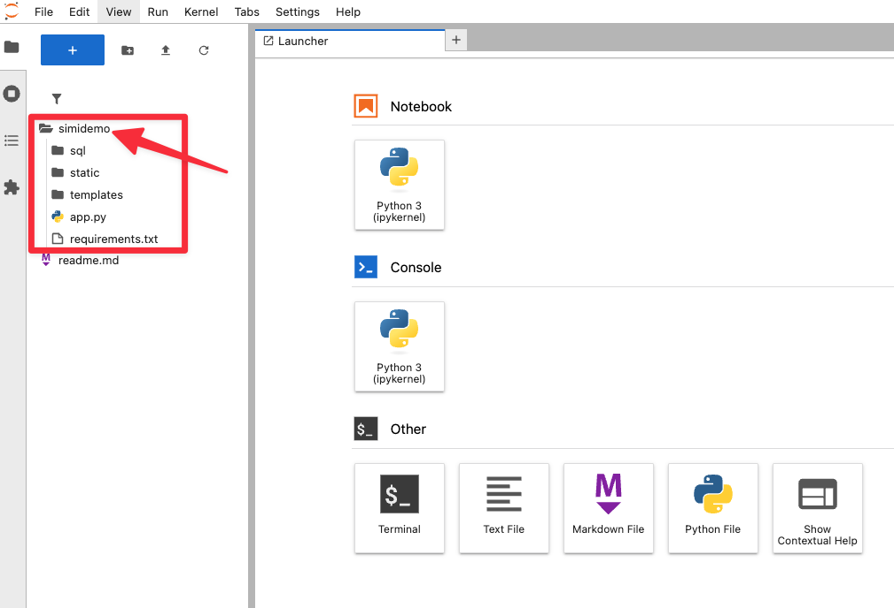
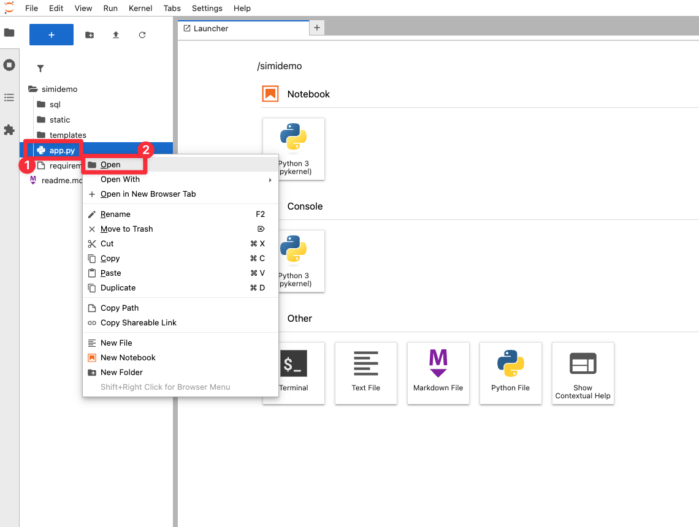
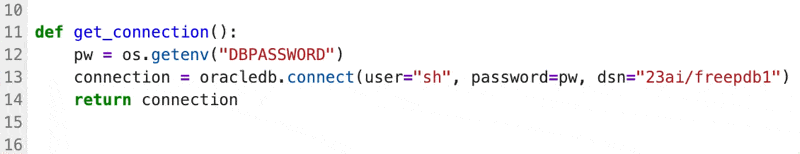
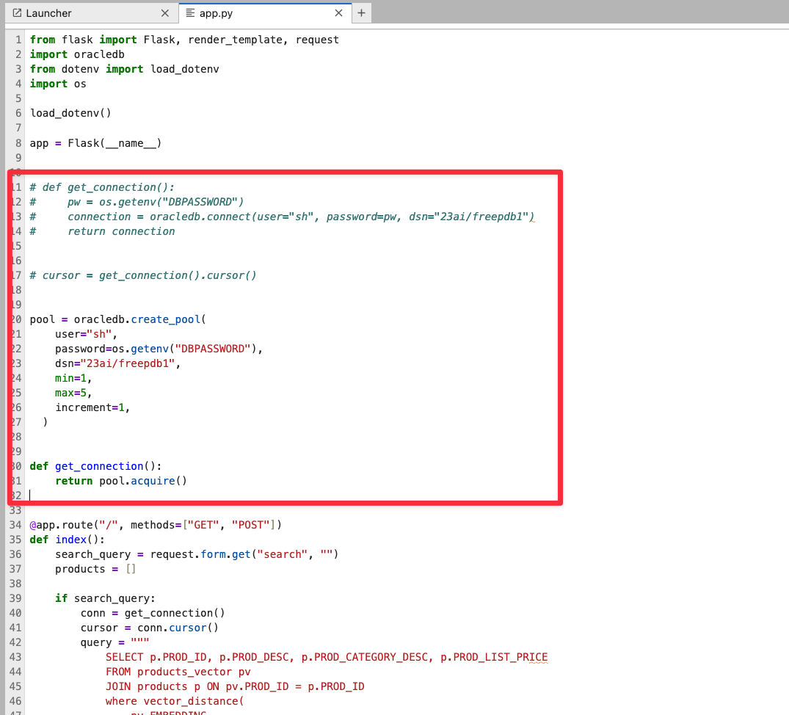
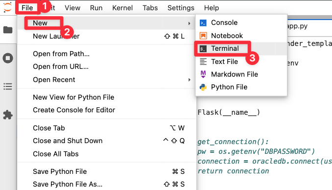
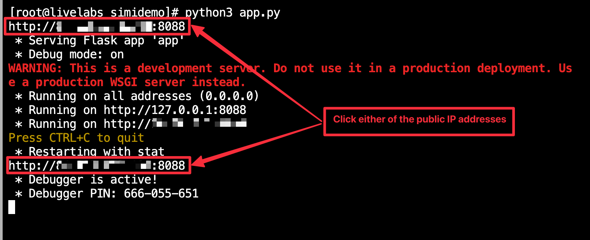
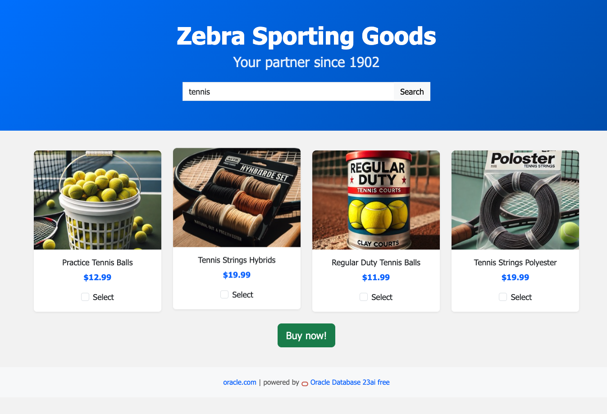
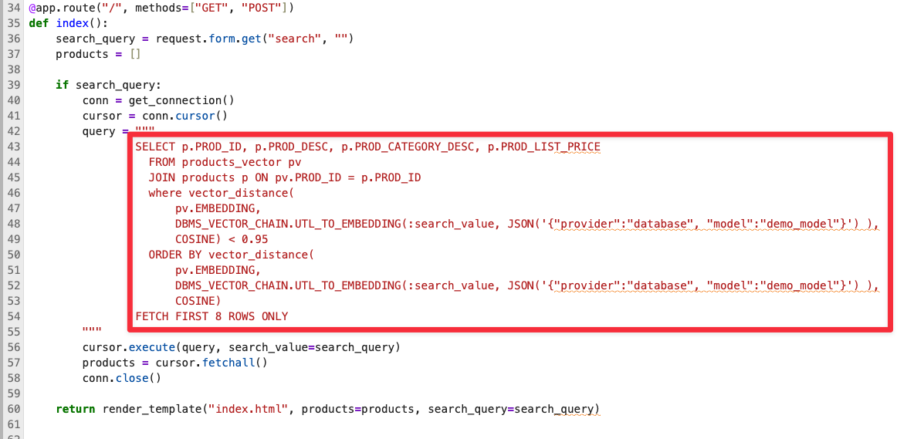
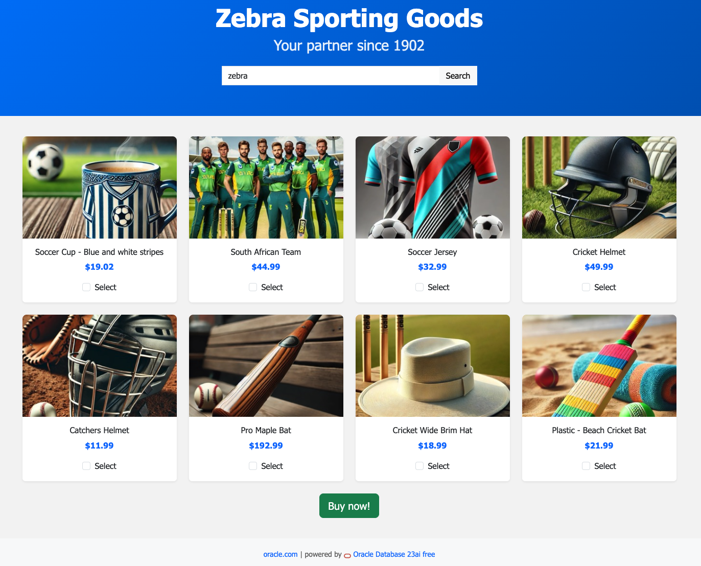

# Explore & improve the code!

## Introduction

In this lab, you will use JupyterLab as your browser-based IDE to explore and modify the code behind the Zebra Sporting Goods demo. You will review how the app connects to Oracle Database 23ai, fine-tune the similarity search logic, and see how your changes affect the live app experience—all in real time. This hands-on exercise helps you understand the key components driving AI-powered product discovery and some fundamentals when using the Oracle Python driver.

Estimated Lab Time: 45 minutes

### About JupyterLabs
JupyterLab is a powerful, browser-based development environment that lets you write, run, and edit code interactively. It’s ideal for exploring data, testing logic, and experimenting with applications—all in one intuitive interface.

### Objectives

In this lab, you will:
* Use JupyterLab to explore the source code of the Zebra Sporting Goods demo application.
* Understand and improve the logic for connecting to Oracle Database 23ai.
* Modify and fine-tune the similarity search implementation, and observe the impact in the live demo.

This lab assumes you have:
* An Oracle Cloud account
* All previous labs successfully completed

## Task 1: Login to JupyterLab

1. To navigate to the development environment, click **View Login Info**. Copy the Development IDE Login Password. Click the Start Development IDE link.

    

2. Paste in the Development IDE Login Password that you copied in the previous step. Click **Login**.

    


## Task 2: Open the application project

This task helps you to understand the structure of the Python application project. You will also learn how to use the JupyterLab interface.

1. Open the **Zebra Sporting Goods** application project in JupyterLab. Click on **simidemo** in the file browser. 

    

    The project contains the following files and folders which are typical for a Flask web application:


    *  **app.py**: The main application file. It contains the code for connecting to Oracle Database and running queries.
    *  **requirements.txt**: A list of Python packages used by the application.
    *  **sql/** : The folder contains the SQL scripts used by the application.
    *  **static/** : The folder contains the static files, such as the product images used by the application.
    *  **templates/** : The folder contains the HTML templates used by the application.


## Task 3: Explore the application code

This task helps you to understand how the code behind the demo works.

1. Open the **app.py** file in JupyterLab. Double-click on **app.py** in the file browser or right-click on it and select **Open**. 

    

2. Once the file opens in JupyterLab, let's review the code to understand how it works. 

   

3. The code in the file is organized into several sections:

  * **Section 1**: Imports, environment variables and Flask app initialization

    ```python
      from flask import Flask, render_template, request
      import oracledb
      from dotenv import load_dotenv
      import os

      load_dotenv()

      app = Flask(__name__)
    ```

  * **Section 2**: A function to establish a connection with Oracle Database Database

    > **Note**: We are using a standalone connection. In a real world scenario, you would use a connection pool which you are going to change in a later task. 

    ```python
      def get_connection():
      pw = os.getenv("DBPASSWORD")
      connection = oracledb.connect(user="sh", password=pw, dsn="23ai/freepdb1")
      return connection
    ```

  * **Section 3**: A function for the similarity search functionality. This is the core business logic of our application. It takes in a query and returns a list of products that match the query.

    The `query` variable contains a user input that is converted into an embedding using the `DBMS_VECTOR_CHAIN.UTL_TO_EMBEDDING` function. This function leverages ONNX models in Oracle Database 23ai to generate the embedding. The `vector_distance` function then compares this embedding to each product's stored embedding to calculate similarity.

    > **Note**: The ONNX model used in our app is already stored in the database and is referenced using the paramater `"model":"demo_model"`

    ```python
    @app.route("/", methods=["GET", "POST"])
    def index():
        search_query = request.form.get("search", "")
        products = []

        if search_query:
            conn = get_connection()
            cursor = conn.cursor()
            query = """
                SELECT p.PROD_ID, p.PROD_DESC, p.PROD_CATEGORY_DESC, p.PROD_LIST_PRICE
                FROM products_vector pv
                JOIN products p ON pv.PROD_ID = p.PROD_ID
                where vector_distance(
                    pv.EMBEDDING,
                    DBMS_VECTOR_CHAIN.UTL_TO_EMBEDDING(:search_value, JSON('{"provider":"database", "model":"demo_model"}') ),
                    COSINE) < 0.7
                ORDER BY vector_distance(
                    pv.EMBEDDING,
                    DBMS_VECTOR_CHAIN.UTL_TO_EMBEDDING(:search_value, JSON('{"provider":"database", "model":"demo_model"}') ),
                    COSINE)
                FETCH FIRST 4 ROWS ONLY
            """
            cursor.execute(query, search_value=search_query)
            products = cursor.fetchall()
            conn.close()

        return render_template("index.html", products=products, search_query=search_query)
    ```


  * **Section 4**: A function that simulates the purchase confirmation

    This function is a placeholder for the actual code that would be used to confirm the purchase. In our demo the function simply returns a list of the selected products and 'confirms' the purchase.

    ```python
    @app.route("/buy", methods=["POST"])
    def buy():
        selected_products = request.form.getlist("selected_products")
        return render_template("confirmation.html", products=selected_products)
    ```

  * **Section 5**: Application execution context

    Here, we are simply saying that block runs the app only when the script is executed directly, not when imported as a module and listen for requests on port 8088 with debug mode enabled.

    ```python
    if __name__ == "__main__":
    app.debug = True
    app.run(
        host="0.0.0.0",
        port=8088,
    )
    ```


## Task 4: Improve the application code — Enable connection pooling

Now, let's do some modifications to improve performance, security, and the end-user experience.

1. Switch from standalone connection to a pooled connection.

    In this section, we are going to switch from using a standalone connection to a pooled connection. This will improve performance and reduce the number of connections that need to be established. Connection pooling can significantly improve application performance and scalability, allows resource sharing, and lets applications use advanced Oracle High Availability features.

2. Comment out the current `get_connection()`. Select the complete function content and hit **CTRL + /** (PC) or **CMD + /** (MacOS).

    

3. Now, paste the following code snippet into the right after the commented function.

    ```python
    <copy>pool = oracledb.create_pool(
        user="sh",
        password=os.getenv("DBPASSWORD"),
        dsn="23ai/freepdb1",
        min=1,
        max=5,
        increment=1,
      )


def get_connection():
        return pool.acquire()</copy>
    ```

    
    Your application code should now look like this:

    

4. Let's test if our application is working correctly. Open a terminal in JupyterLab. There are multiple ways to do this, for example using the **Launcher** or click **File**,  select **New**, and then select **Terminal** as shown below:

    


5. Ensure that you are in the application project's root directory by entering the following command:

    ```bash
      $ <copy>cd /home/simidemo
      </copy>
    ```

6. Run the following command to test your application:

    ```bash
      $ <copy>python3 app.py
      </copy>
    ```

7. You should see the following output. Click on either of the public IP addresses to open your application in a web browser:

   

8. Confirm the application is started and you are able to search for products:

    


**Congratulations!** You have successfully enabled **pooled connections** in your application.

Next, return to the terminal and press CTRL+C (PC) or CMD+C (MacOS) to terminate the running app.


## Task 54: Improve the application code — Change the end-user experience 

Now, we want to change the end-user experience. We need to increase the number of displayed products to eight and widen the similarity threshold to include more distant matches.

> **Note**: Make sure that your application is running before you continue with the lab. In the terminal, press CTRL+C (PC) or CMD+C (MacOS) to terminate the running app.

1. Open the `app.py` file and locate the query function. We are specifically interested in the SQL query:

    ```sql
            SELECT p.PROD_ID, p.PROD_DESC, p.PROD_CATEGORY_DESC, p.PROD_LIST_PRICE
              FROM products_vector pv
              JOIN products p ON pv.PROD_ID = p.PROD_ID
              where vector_distance(
                  pv.EMBEDDING,
                  DBMS_VECTOR_CHAIN.UTL_TO_EMBEDDING(:search_value, JSON('{"provider":"database", "model":"demo_model"}') ),
                  COSINE) < 0.7
              ORDER BY vector_distance(
                  pv.EMBEDDING,
                  DBMS_VECTOR_CHAIN.UTL_TO_EMBEDDING(:search_value, JSON('{"provider":"database", "model":"demo_model"}') ),
                  COSINE)
            FETCH FIRST 4 ROWS ONLY
    ```

2. First, let's review the `WHERE` clause in our query and notice that we restrict the results to only return products that are within a distance of `0.7` from our search value.

    ```sql
    where vector_distance(
                pv.EMBEDDING,
                DBMS_VECTOR_CHAIN.UTL_TO_EMBEDDING(:search_value, JSON('{"provider":"database", "model":"demo_model"}') ),
                COSINE) < 0.7
    ```

3. Let's increase the distance and change it to `0.95`

    ```sql
    where vector_distance(
                pv.EMBEDDING,
                DBMS_VECTOR_CHAIN.UTL_TO_EMBEDDING(:search_value, JSON('{"provider":"database", "model":"demo_model"}') ),
                COSINE) < 0.95
    ```

4. Next, have a look at the `ORDER BY` clause in the query. Currently, we are only fetching the first four rows. Let's change this to `8`. So, our complete query should look like this. You can copy and complete query below and replace it in your application code.

    ```sql
    <copy>
            SELECT p.PROD_ID, p.PROD_DESC, p.PROD_CATEGORY_DESC, p.PROD_LIST_PRICE
              FROM products_vector pv
              JOIN products p ON pv.PROD_ID = p.PROD_ID
              where vector_distance(
                  pv.EMBEDDING,
                  DBMS_VECTOR_CHAIN.UTL_TO_EMBEDDING(:search_value, JSON('{"provider":"database", "model":"demo_model"}') ),
                  COSINE) < 0.95
              ORDER BY vector_distance(
                  pv.EMBEDDING,
                  DBMS_VECTOR_CHAIN.UTL_TO_EMBEDDING(:search_value, JSON('{"provider":"database", "model":"demo_model"}') ),
                  COSINE)
            FETCH FIRST 8 ROWS ONLY
    </copy>
    ```

    After the update, your updated function should look like this:

    


5. Let's test if our application is working correctly. Open a terminal in JupyterLab. There are multiple ways to do this, for example using the **Launcher** or click **File**,  select **New**, and then select **Terminal** as shown below:

    


6. Ensure that you are in the application project's root directory by entering the following command:

    ```bash
      $ <copy>cd /home/simidemo
      </copy>
    ```

7. Run the following command to test your application:

    ```bash
      $ <copy>python3 app.py
      </copy>
    ```

7. You should see the following output. Click on either of the public IP addresses to open your application in a web browser:

   

8. Confirm the application is started and you are able to search for products. Also, you should see now a total of eight products in the list. You will also notice that some results have a lower semantic similarity to the search term.

   

**Congratulations!** You have successfully updated the end-user experience. Your application displays more results and includes also items with a lower semantic similarity.

Next: Feel free to continue exploring the code and improving it. 🤘


## Acknowledgements
* **Author** - Kevin Lazarz, Senior Manager, Database Product Management
* **Last Updated By/Date** - Kevin Lazarz, June 2025
