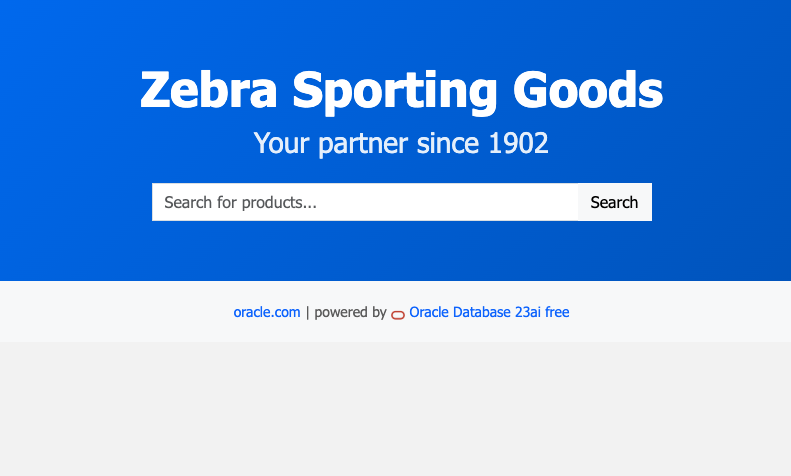
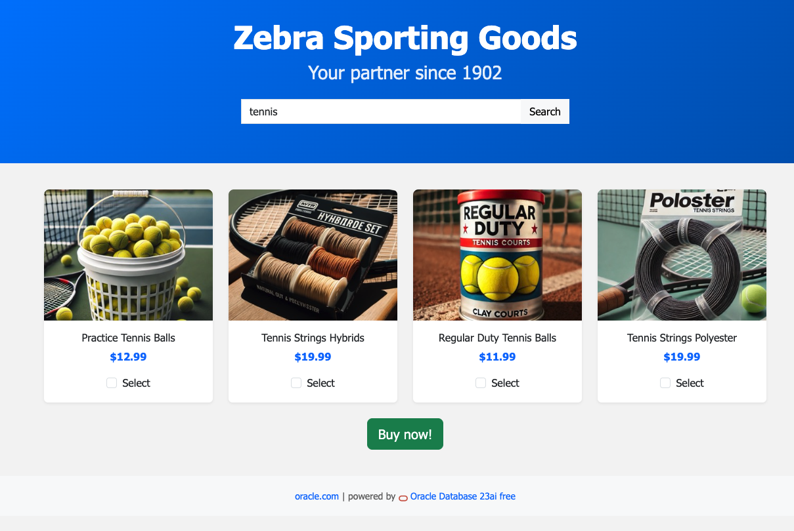
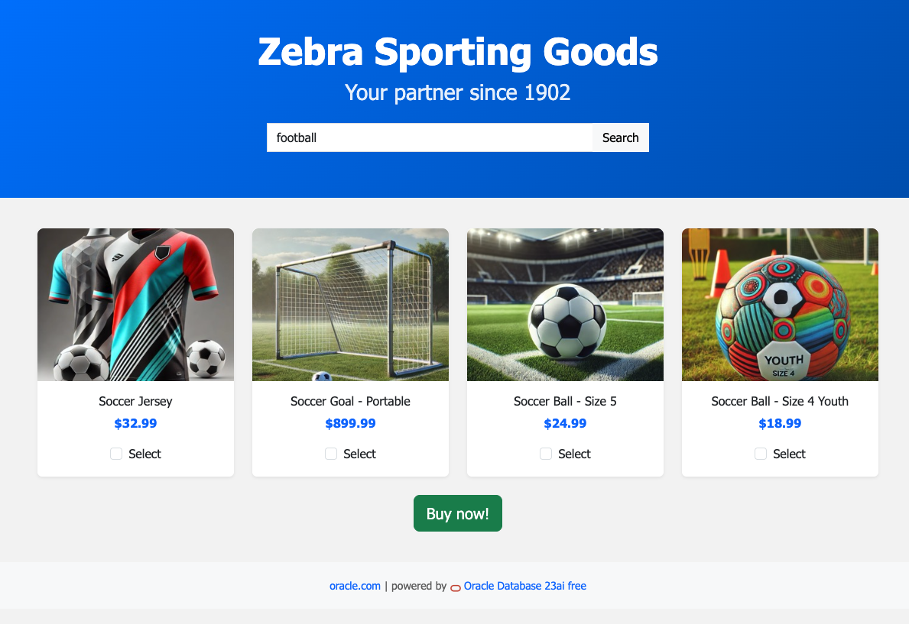
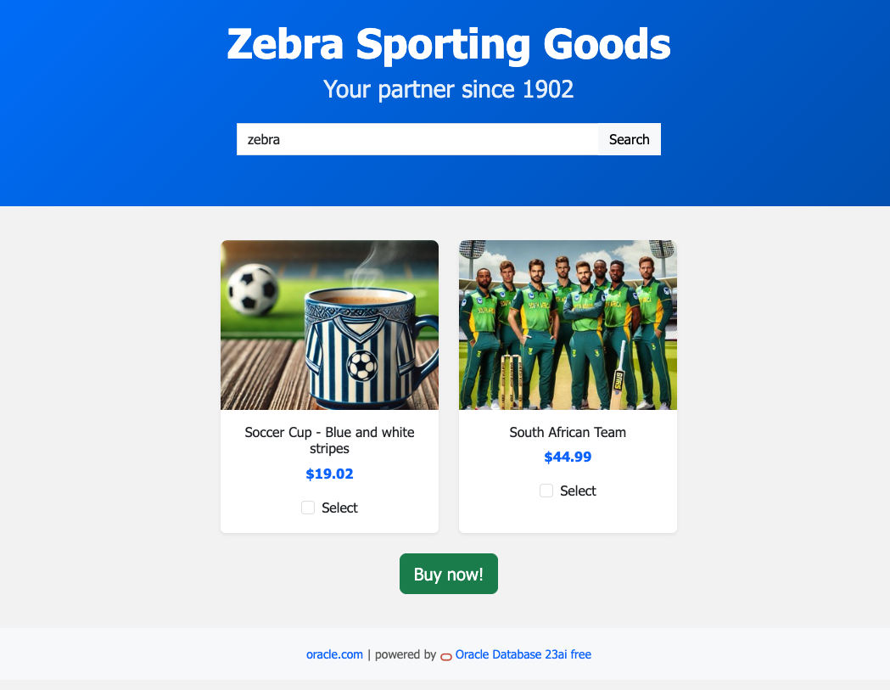

# Run the demo!

## Introduction

In this lab, you will walk through the Zebra Sporting Goods demo and experience how similarity search enhances the shopping journey. Follow the steps below to explore the app just like a customer would—no exact keywords needed

Estimated Time: 15 minutes

### Objectives

In this lab, you will:
* Interact with the Zebra Sporting Goods demo to understand how similarity search improves product discovery.
* Experience the difference between traditional keyword search and AI-powered similarity search from a user’s perspective.
* Observe how vector-based search results are generated in real time using Oracle Database 23ai.

This lab assumes you have:
* An Oracle Cloud account.
* You have access to the demo via the **View Login Details** information.

## Task 1: Launch the demo!

1. To access the demo environment, click **View Login Info** in the top left corner of the page. Click the **Start the Demo** link.

    

## Task 2: Run the demo!

The Zebra Sporting Goods demo app has been set up for you in Oracle Cloud Infrastructure (OCI). You have access to a link that allows you to view and interact with the app. Follow these steps to run the demo:

1. Search for a typical sports related item or simply a sport, such as *tennis*.

    

    You should see a list of items with the price and also the product description (which contains the keyword *tennis*).

2. Let's search for a another sports, such as *football*.

    

    Again, you should see a list of items with the price and also the product description. The main difference now is that the none of the descriptions contain the keyword *football*. The app uses vector-based search to find similar products based on their descriptions.

3. Search for your favorite sports mascot, the *Zebra*.

    

    You should see two products displayed, each with a price and description—even though neither description contains the keyword zebra. These items are considered similar based on their content: the blue-and-white striped cup and the Zebra-themed item both evoke the idea of zebras. There's also an inferred link between zebras and South Africa, a region where zebras are commonly found.

**Conclusion:** The demo shows how similarity search can be used to enhance product discovery. By leveraging vector-based search, the app is able to find similar products based on their descriptions, even when no exact keywords are provided by a customer.

Are you curious how it is done? Check out the hands-on lab which allows you to analyze the code and see how it works. In the hands-on lab, you will also see how the search results are restricted and how to control the number of results returned.

## Task 3: Continue to explore the shopping portal

1. Try searching for different keywords and observe the results. Do the returned products share clear similarities with your search term, even if the keyword isn’t explicitly mentioned in the descriptions?

  Here are some keywords to try:
 * "sea"
 * "plastic"
 * "beach"
 * "protection"
 * "golf club"
 * "water"
 * "heat"
 * "water"  

...what else can you find? 😎

## Acknowledgements
* **Author** - Kevin Lazarz, Senior Manager, Database Product Management
* **Last Updated By/Date** - Kevin Lazarz, June 2025
