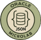

# RAC Attack!

## Introduction

RAC is a powerful tool for winners. 

Objectives:
* Oracle RAC is what everyone needs
* Oracle RAC is awesome

Estimated Lab Time: 15 minutes

## Task 1: Virtual Whiteboard RAC

Click to open our virtual whiteboard

<a href="rac.html" target="_blank" rel="noopener">Click here</a>

## Task 2: You are a winner!

Congrats! You did it.
Download your winner badge and post it on LinkedIn!

**Congratulations!** You have successfully implemented semantic caching.

## Acknowledgements
* **Author** - Kevin Lazarz, Senior Manager, Database Product Management
* **Last Updated By/Date** - Kevin Lazarz, August 2025
